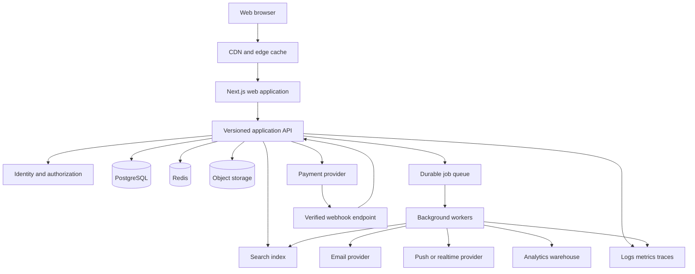

# SkillSpace System Architecture and Development Plan

## 1. Document Purpose

This document describes how to rebuild the current SkillSpace prototype into a production-quality platform for discovering, joining, creating, and operating online communities.

The goal is not to reproduce the current files one-for-one. The goal is to preserve the useful product direction and visual language while replacing the fragile parts of the prototype with a system that is:

- Functionally complete
- Secure by default
- Fast for common user journeys
- Maintainable by multiple developers
- Testable at every important boundary
- Reusable across web, mobile, and future integrations
- Reliable under partial failures
- Scalable without prematurely splitting everything into microservices

This is a target architecture and delivery plan. It deliberately separates decisions that should be made now from decisions that should wait until real usage data exists.

---

## 2. Product Understanding

### 2.1 Product concept

SkillSpace is a community marketplace and learning platform. A visitor should be able to discover communities around interests or outcomes. A member should be able to join a community, consume learning content, participate in discussions, message other members, and track progress. A creator should be able to create and operate a community, publish content, manage members, monetize access, and understand business performance.

The primary product loop is:

1. A visitor discovers a relevant community.
2. The visitor inspects its promise, activity, price, and access model.
3. The visitor registers or signs in.
4. The visitor joins or purchases membership.
5. The member participates in posts, courses, events, and chat.
6. The member receives useful progress, social, and transactional notifications.
7. The member returns because the community produces ongoing value.
8. A successful member may create a community or refer another creator.

### 2.2 Capabilities visible in the current prototype

The current implementation already points toward these capabilities:

- Community discovery grid
- Search by community title
- Category navigation such as Hobbies, Music, Money, Tech, Health, and Sports
- Price filtering for free and paid communities
- Public and private access filtering
- Trending and top sorting
- Authentication dialogs
- Password reset and code-login placeholders
- User profile page
- Activity heatmap
- Memberships and contributions
- Settings areas for profile, affiliates, payouts, account, notifications, chat, payment methods, payment history, and theme
- Chat and notification dropdowns
- Community creation entry point
- Community marketplace imagery and creator-focused copy

### 2.3 Broader intended product capabilities

The existing notes and data generators also describe a broader learning community product:

- Discussion feed
- Posts, likes, and comments
- Courses and video modules
- Progress tracking
- Level and points system
- Leaderboards
- Community membership
- User profiles and presence

These features should be treated as part of the product roadmap, not as separate unrelated applications.

### 2.4 Product principles

1. **Discovery should be immediate.** The first screen should show real communities and make comparison easy.
2. **Community value should be legible.** A user should understand who the community is for, what they will get, how active it is, and what it costs.
3. **Participation should be low friction.** Posting, replying, learning, joining an event, and messaging should require very few steps.
4. **Creators need operational tools.** Community creation is not complete when a record is created; creators need publishing, moderation, member, revenue, and analytics workflows.
5. **Money and permissions are sensitive domains.** Membership access, payouts, refunds, and moderator actions must be server-authoritative and auditable.
6. **The interface should stay quiet and recognizable.** Keep the current dark, compact, community-first feel, but make hierarchy, accessibility, loading states, and responsive behavior consistent.
7. **The architecture should earn complexity.** Start as a modular monolith and extract services only when ownership, load, or team boundaries justify it.

---

## 3. Current Prototype Assessment

### 3.1 What is useful and should be retained

The current prototype is valuable as a product prototype because it has already explored:

- The core navigation model
- The visual identity and dark theme
- The community-card information density
- The creator call to action
- The profile/settings information architecture
- The basic authenticated versus unauthenticated experience
- The terminology users will see

The current static data is also useful as seed data for local development and visual testing.

### 3.2 Problems that must not become production foundations

#### Client-owned security state

The prototype stores users, sessions, and authentication-related state in `localStorage`. A browser user can modify it. Password hashing in the browser does not make client-side authentication secure because the browser controls the code and stored values.

Production authentication must be handled by a server. Passwords must be hashed on the server with Argon2id or a comparable password hashing algorithm. Sessions must be stored and invalidated server-side or represented by short-lived tokens with secure rotation and revocation behavior.

#### In-memory and mock data

Communities, chats, notifications, and user records are JavaScript arrays. This prevents multiple users from seeing consistent data and makes all writes disappear when the prototype data changes.

Production data belongs in a database with explicit constraints, indexes, transactions, migrations, and ownership rules.

#### HTML assembled directly in JavaScript

Large template strings combine data access, presentation, and event behavior. This makes accessibility, escaping, testing, and reuse difficult. It also creates an injection risk if any future server data is inserted without careful escaping.

Use typed components, server/client boundaries, validated API responses, and a design system.

#### Incomplete behavior hidden behind alerts

Actions such as changing a profile photo, copying affiliate links, help center access, changing email, and changing passwords are represented by alerts. These should become real workflows with success, failure, loading, and permission states.

#### Weak filtering and sorting model

The current filtering is local and only searches title text. The production discovery API should support normalized search, category and price facets, public/private visibility rules, pagination, stable sorting, and eventually relevance ranking.

#### No explicit domain model

The current data does not define ownership, membership status, moderation roles, entitlements, payment states, content publication states, or audit history. These must be modeled explicitly before feature work expands.

#### Accessibility and interaction gaps

Interactive elements are often links or generic elements with inline handlers. A production UI needs keyboard navigation, visible focus, semantic labels, correct dialog behavior, screen-reader announcements, reduced-motion support, and responsive layouts.

#### Uncontrolled external images

External image URLs are used directly. Production media should be uploaded through controlled endpoints, scanned or validated, transformed into responsive sizes, and served through an image CDN.

#### Generated data is non-deterministic

The data generator uses random values, making tests and visual comparisons unstable. Seed fixtures and deterministic factories are required.

### 3.3 Falsifiable migration hypothesis

The smallest architecture that can support the stated product is a modular monolith with a relational source of truth, an asynchronous job layer, and a web client consuming typed application APIs. This hypothesis is disproved if a measured workload requires independently scaling a domain or if separate deployment ownership becomes a real organizational constraint. Until then, microservices would add operational cost without solving the current bottlenecks.

---

## 4. Scope and Requirements

### 4.1 User roles

#### Visitor

- Browse public community listings
- Search and filter communities
- View a public community landing page
- Register, sign in, or request account recovery

#### Member

- Maintain a profile
- Join free communities
- Purchase paid memberships
- View community content allowed by entitlement
- Create posts, comments, reactions, and bookmarks
- Complete lessons and view progress
- Attend or register for events
- Send and receive direct messages according to privacy rules
- Receive notifications
- Leave or manage memberships

#### Creator

- Create and configure communities
- Define pricing, billing interval, access type, and policies
- Publish posts, courses, lessons, events, and resources
- Manage community members and roles
- Moderate reports and content
- View membership and revenue analytics
- Configure payout details
- Manage affiliate/referral programs

#### Moderator

- Review reports
- Hide or restore content
- Suspend members within assigned scope
- Apply moderation actions with reason and audit record

#### Platform administrator

- Manage users, communities, categories, payments, disputes, and moderation escalations
- Configure platform policy
- Access operational audit logs
- Manage feature flags and system configuration

A user may hold multiple roles in different communities. Authorization must therefore be scoped by resource, not represented as one global `isAdmin` flag.

### 4.2 Functional requirements

#### Discovery

- Public community catalog
- Search by title, description, creator, and category
- Category and topic facets
- Free, paid, and price-range filters
- Public/private or application-required access filters
- Trending, newest, and top sorting
- Cursor pagination
- Empty, loading, error, and retry states
- Community detail page with clear join action

#### Identity and account

- Registration with email verification
- Login and logout
- Password reset
- Optional passwordless code login
- Optional OAuth providers later
- Session management across devices
- Account deletion and export requests
- Profile, avatar, bio, location, and social links
- Privacy controls
- Notification preferences

#### Community lifecycle

- Draft, review, published, suspended, and archived states
- Creator onboarding
- Slug and branding configuration
- Public landing page
- Community access policy
- Free and paid membership plans
- Trial and promotional support later
- Community roles and permissions
- Membership approval for private communities
- Member removal and bans
- Community deletion with retention policy

#### Social participation

- Posts and comments
- Replies and threaded discussions
- Reactions
- Mentions
- Attachments and links
- Edit history or edit time window
- Reporting and moderation
- Bookmarks
- Activity feed

#### Learning

- Courses
- Sections and lessons
- Video, text, download, and external-resource lesson types
- Publication controls
- Entitlement checks
- Lesson completion
- Course progress
- Resume playback position
- Creator progress analytics
- Certificates as a later capability

#### Events

- Event creation and publication
- Time zone-aware scheduling
- RSVP and capacity
- Calendar export
- Event reminders
- Recording or replay links

#### Messaging and notifications

- Direct messages
- Community or group chat as a later capability
- Read state
- Unread counts
- Notification inbox
- Email and in-app notification channels
- User preferences and quiet hours
- Delivery and failure tracking

#### Monetization

- Membership plans
- Checkout
- Payment provider integration
- Subscription lifecycle synchronization through webhooks
- Invoices and receipts
- Refunds and cancellations
- Entitlement activation and expiration
- Creator revenue ledger
- Payout onboarding and status
- Affiliate referral attribution
- Chargeback and dispute handling

#### Gamification

- Points ledger rather than mutable points-only balance
- Level calculation
- Badges and achievements
- Community-scoped and platform-scoped leaderboards
- Anti-abuse limits
- Reversible administrative adjustments

#### Settings and operations

- Profile settings
- Account security
- Notification settings
- Payment methods
- Payment history
- Payout settings
- Theme and accessibility preferences
- Community management settings
- Admin and moderation tools

### 4.3 Non-functional requirements

#### Performance targets

Initial targets for the public web application:

- Largest Contentful Paint under 2.5 seconds on a representative mobile connection for the discovery page
- Interaction to Next Paint under 200 milliseconds for common local interactions
- API p95 under 300 milliseconds for cached discovery reads
- API p95 under 500 milliseconds for ordinary authenticated reads
- API p95 under 800 milliseconds for ordinary writes excluding external payment providers
- No unbounded database queries or unpaginated member/content lists

These are targets to measure, not promises to make without representative load tests.

#### Availability and recovery

- 99.9% monthly availability target for core browsing and authenticated workflows after the first production phase
- Automated database backups
- Point-in-time recovery where supported
- Recovery point objective of 15 minutes or better for primary transactional data
- Recovery time objective of 1 hour or better for the initial production system
- Documented incident response and rollback procedures

#### Security

- Server-side authorization for every protected mutation and read
- Secure password hashing
- Secure, HttpOnly, SameSite cookies for browser sessions
- CSRF protection where cookie-authenticated mutations require it
- Rate limiting for authentication, messaging, posting, and expensive search
- Input validation at API boundaries
- Output encoding in rendered content
- Content Security Policy
- Dependency and secret scanning
- Audit logging for sensitive actions
- Payment provider webhooks verified cryptographically

#### Maintainability

- TypeScript with strict compiler settings
- Domain-oriented modules
- Shared schema contracts
- Automated formatting and linting
- Unit, integration, contract, end-to-end, accessibility, and load tests
- Small pull requests with required review
- Architecture decision records for significant choices
- Observability built into every important workflow

---

## 5. Recommended Technology Baseline

The following stack is a recommendation, not a requirement to adopt every tool immediately.

### 5.1 Repository and language

- TypeScript with `strict: true`
- pnpm workspaces
- Turborepo or a similarly lightweight task orchestrator
- ESLint and Prettier
- Vitest for unit and integration tests
- Playwright for browser tests
- OpenAPI or generated schema contracts

### 5.2 Web application

- Next.js with the App Router
- React and server-rendered public pages
- Client components only for interactive surfaces
- TanStack Query for client-side server state where needed
- React Hook Form plus Zod for complex forms
- Accessible component primitives such as Radix UI, Ariakit, or an internally governed equivalent
- A small internal design system that preserves the current compact dark visual language

Next.js is useful here because public discovery and community pages benefit from server rendering, metadata, caching, and fast initial navigation. It also provides a clear path to route-level loading and error states.

### 5.3 API and application layer

Start with a modular TypeScript API in the same repository. NestJS with Fastify, Fastify with a structured plugin architecture, or a comparable framework are all viable. The important decision is the module boundary and validation discipline, not the framework brand.

The API should expose versioned application contracts such as `/api/v1/communities`, `/api/v1/memberships`, and `/api/v1/courses`. Domain modules should not import database implementation details into the UI.

### 5.4 Primary database

- PostgreSQL as the transactional source of truth
- Prisma, Drizzle, or another migration-first typed ORM
- Read replicas only after measurement shows a need
- PostgreSQL full-text search initially if catalog scale is modest
- Dedicated search infrastructure later for relevance, typo tolerance, autocomplete, and faceting

PostgreSQL is a strong fit because the platform has relational, transactional workflows: memberships, roles, plans, invoices, entitlements, progress, and moderation all benefit from constraints and transactions.

### 5.5 Cache and asynchronous work

- Redis for short-lived caching, rate limiting, distributed locks, and job coordination
- A durable job system such as BullMQ, Cloud Tasks, or a managed queue
- Worker process for email, notifications, media processing, analytics events, search indexing, and webhook retries

Redis should not be the source of truth for memberships, payment status, or permissions.

### 5.6 Storage and media

- S3-compatible object storage for avatars, community covers, attachments, and creator media
- CDN for delivery
- Presigned upload URLs
- Server-side file metadata records
- MIME type, size, extension, and malware scanning policies
- Image resizing and responsive variants
- Private media delivered through signed URLs when required

### 5.7 Payments

Use a provider such as Stripe for payment method handling, subscriptions, invoices, refunds, and creator payouts where supported. The platform database stores a normalized financial record and entitlement state; it does not pretend to be the payment provider.

### 5.8 Observability and operations

- Structured JSON logs
- OpenTelemetry traces
- Error tracking such as Sentry
- Metrics and dashboards
- Uptime checks
- Database and queue monitoring
- Centralized audit event stream

---

## 6. High-Level Architecture



### 6.1 Request flow

1. The browser requests a page or API resource.
2. Public, cacheable content is served from the CDN or rendered by the web application.
3. Protected requests include a secure session or access token.
4. The API authenticates the request, validates input, and resolves authorization.
5. The application service executes a use case through repositories and domain policies.
6. PostgreSQL commits the authoritative state change.
7. An outbox event is written in the same transaction when asynchronous work is needed.
8. A worker publishes notifications, updates search, processes media, or records analytics.
9. The API returns a typed response or a stable error shape.

### 6.2 Why a modular monolith first

A modular monolith keeps transactions simple and local while the product and team are still evolving. It allows the team to:

- Share types and validation without network boundaries
- Debug a workflow in one deployment
- Keep membership and payment updates transactional
- Avoid distributed transaction problems
- Deploy quickly
- Extract a module later behind an explicit contract if load or ownership requires it

The code should still behave as if modules have boundaries. No module should reach into another module's tables or private classes casually.

---

## 7. Domain Modules

Each module owns its business rules and persistence access. Cross-module communication should use application services, domain events, or public query interfaces.

### 7.1 Identity and access

Owns:

- Users
- Email addresses and verification
- Password credentials
- Sessions and refresh tokens
- Login challenges
- Account recovery
- Device/session management
- Global user preferences

Important rules:

- Email uniqueness is case-insensitive.
- Password hashes are never returned to the web client.
- Session tokens are rotated on login and privilege changes.
- Sensitive changes require recent authentication or step-up verification.
- Account deletion is a workflow, not an immediate cascading delete.

### 7.2 Profiles and social graph

Owns:

- Public profile fields
- Avatar reference
- Bio and social links
- Followers/following
- Presence status policy
- Profile visibility

A profile is separate from authentication. The user record should not become a bag of all public and private profile fields.

### 7.3 Communities

Owns:

- Community identity and slug
- Branding and cover media
- Description and category
- Publication state
- Access policy
- Community settings
- Creator ownership
- Community roles
- Moderation policy configuration

A community should have an immutable internal ID and a mutable human-readable slug. Slug changes require redirects or alias records.

### 7.4 Memberships and entitlements

Owns:

- Membership records
- Join requests
- Membership status
- Role assignment within a community
- Plan association
- Entitlement grants and expiration
- Leave, suspension, ban, and cancellation states

This module is the source of truth for whether a user may access community resources. UI checks are only presentation hints.

### 7.5 Content and discussions

Owns:

- Posts
- Comments and replies
- Reactions
- Mentions
- Attachments
- Bookmarks
- Content publication and edit rules
- Content reports

Content should be modeled independently of a particular UI feed so the same records can power web, email digests, and future mobile clients.

### 7.6 Learning

Owns:

- Courses
- Sections
- Lessons
- Lesson resources
- Publication state
- Lesson completion
- Progress and resume position
- Course access policy

The learning module asks the membership/entitlement module whether a user may access protected content. It does not duplicate payment logic.

### 7.7 Events

Owns:

- Events
- Schedules and time zones
- RSVP records
- Capacity
- Reminder schedule
- Recording metadata

Time should be stored in UTC with the event's intended IANA time zone stored separately for display and recurrence behavior.

### 7.8 Messaging

Owns:

- Conversations
- Participants
- Messages
- Read cursors
- Message reports
- Blocking and messaging permissions

The first version can use HTTP polling or a managed realtime provider. WebSockets should be introduced when product usage demonstrates the need. Message writes remain transactional; realtime delivery is a projection of committed state.

### 7.9 Notifications

Owns:

- In-app notifications
- Notification preferences
- Delivery attempts
- Email templates and routing
- Read state

A notification should reference a domain event and a stable target rather than embedding an unstructured sentence as the only record.

### 7.10 Billing and payouts

Owns:

- Products and membership plans
- Checkout sessions
- Provider customer and subscription IDs
- Invoices
- Payment attempts
- Refunds
- Creator balances
- Payout state
- Affiliate attribution

The provider is authoritative for payment execution. The platform is authoritative for its internal entitlement and reporting model after verified provider events are processed.

### 7.11 Gamification

Owns:

- Point event ledger
- Rules and caps
- Level thresholds
- Badges
- Achievement grants
- Leaderboard read models

Never increment a mutable total without recording why. A ledger makes abuse investigation, correction, and rebuilding possible.

### 7.12 Moderation and trust

Owns:

- Reports
- Review queues
- Content actions
- User restrictions
- Community restrictions
- Appeals
- Audit records

Moderation actions must record actor, scope, reason, target, previous state, new state, and timestamp.

### 7.13 Analytics

Owns:

- Product event definitions
- Creator-facing aggregate metrics
- Funnel events
- Revenue and retention projections

Operational tables should not be used for every analytics query. Emit normalized events and build read models or warehouse tables for reporting.

---

## 8. Data Model

The following is a logical model. Exact columns should be refined during implementation.

### 8.1 Identity tables

- `users`
- `user_credentials`
- `user_email_verifications`
- `user_sessions`
- `login_challenges`
- `account_recovery_requests`
- `user_preferences`
- `user_devices`

Recommended properties:

- UUID or equivalent non-sequential public identifiers
- `created_at`, `updated_at`
- Soft deletion or lifecycle status where recovery/audit requires it
- Unique case-insensitive email index
- No password or token fields in general-purpose user queries

### 8.2 Community and membership tables

- `communities`
- `community_slugs`
- `community_categories`
- `community_topics`
- `community_roles`
- `community_role_permissions`
- `community_memberships`
- `membership_plans`
- `membership_entitlements`
- `membership_join_requests`
- `community_invites`

Important constraints:

- A user has at most one active membership per community and plan context.
- A community has one owner but may have many administrators and moderators.
- Membership state transitions are validated server-side.
- A suspended or banned membership cannot access protected content.

### 8.3 Content and learning tables

- `posts`
- `post_revisions`
- `comments`
- `reactions`
- `bookmarks`
- `mentions`
- `content_attachments`
- `courses`
- `course_sections`
- `lessons`
- `lesson_resources`
- `lesson_progress`
- `course_progress`

Use publication states such as `draft`, `scheduled`, `published`, and `archived` rather than a collection of booleans whose combinations are ambiguous.

### 8.4 Communication tables

- `conversations`
- `conversation_participants`
- `messages`
- `message_read_cursors`
- `notifications`
- `notification_deliveries`
- `notification_preferences`

Use cursor-based pagination for messages and feeds. Do not load an entire conversation into the browser.

### 8.5 Billing tables

- `billing_customers`
- `billing_products`
- `billing_prices`
- `checkout_sessions`
- `subscriptions`
- `invoices`
- `payment_transactions`
- `refunds`
- `creator_ledger_entries`
- `payout_accounts`
- `payouts`
- `affiliate_referrals`
- `provider_webhook_events`

Provider webhook event IDs must be unique so retries are idempotent.

### 8.6 Trust and audit tables

- `content_reports`
- `moderation_cases`
- `moderation_actions`
- `user_restrictions`
- `audit_events`
- `data_export_requests`
- `data_deletion_requests`

Audit records should be append-only from the application perspective.

### 8.7 Indexing strategy

Start with indexes based on access paths, not columns that merely look important.

Examples:

- Communities by publication state, category, and created time
- Case-insensitive community slug
- Active memberships by community and user
- Posts by community and created time
- Comments by post and created time
- Notifications by user, read state, and created time
- Messages by conversation and created time
- Progress by user and lesson/course
- Provider webhook events by provider event ID

Review indexes with query plans and production telemetry. Too many indexes slow writes and increase storage cost.

---

## 9. API and Contract Design

### 9.1 API rules

- Version public application APIs.
- Validate every request body, query parameter, path parameter, and uploaded file descriptor.
- Return consistent error objects.
- Use cursor pagination for potentially large collections.
- Use idempotency keys for checkout, membership-changing, and other retryable commands.
- Include request IDs in responses and logs.
- Keep provider-specific data behind the billing module.
- Never expose database entities directly as API contracts.

### 9.2 Example resource areas

```text
GET    /api/v1/communities
GET    /api/v1/communities/:slug
POST   /api/v1/communities
PATCH  /api/v1/communities/:id

POST   /api/v1/communities/:id/join
POST   /api/v1/communities/:id/join-requests
DELETE /api/v1/communities/:id/membership

GET    /api/v1/communities/:id/feed
POST   /api/v1/communities/:id/posts
POST   /api/v1/posts/:id/comments
POST   /api/v1/posts/:id/reactions

GET    /api/v1/communities/:id/courses
GET    /api/v1/courses/:id
POST   /api/v1/lessons/:id/progress

GET    /api/v1/notifications
POST   /api/v1/notifications/:id/read
GET    /api/v1/conversations
POST   /api/v1/conversations/:id/messages

POST   /api/v1/billing/checkout-sessions
GET    /api/v1/billing/payment-history
POST   /api/v1/billing/webhooks/provider
```

### 9.3 Stable error shape

```json
{
  "error": {
    "code": "MEMBERSHIP_REQUIRED",
    "message": "You need an active membership to access this content.",
    "fields": [],
    "requestId": "req_01..."
  }
}
```

The `code` is for programmatic behavior. The message is safe for display but should not be relied on for branching.

### 9.4 Commands versus queries

Use explicit application use cases:

- `SearchCommunities`
- `CreateCommunity`
- `PublishCommunity`
- `JoinFreeCommunity`
- `CreateCheckoutSession`
- `ProcessPaymentWebhook`
- `CreatePost`
- `CompleteLesson`
- `MarkNotificationRead`
- `ApplyModerationAction`

This keeps business rules out of route handlers and makes important behavior directly testable.

---

## 10. Frontend Architecture and UI Direction

### 10.1 Preserve the current product feel

Keep these qualities from the prototype:

- Dark neutral foundation
- Lime/green and restrained blue accent usage
- Compact top navigation
- Community cards with prominent cover media
- Clear category filters
- Creator-focused entry point
- Dense but readable settings layout
- Simple modal interactions

Improve them with:

- A consistent spacing and typography scale
- Stronger contrast and focus states
- Semantic components
- Consistent button and icon behavior
- Predictable responsive breakpoints
- Route-level loading and error states
- Real empty states that lead to the next action
- Skeletons that match the final layout

### 10.2 Suggested frontend structure

```text
apps/web/
  app/
    (marketing)/discover/page.tsx
    (auth)/login/page.tsx
    (auth)/register/page.tsx
    communities/[slug]/page.tsx
    communities/[slug]/feed/page.tsx
    communities/[slug]/classroom/page.tsx
    communities/[slug]/leaderboard/page.tsx
    dashboard/communities/page.tsx
    dashboard/settings/page.tsx
    api/
  components/
    ui/
    navigation/
    discovery/
    communities/
    learning/
    messaging/
    settings/
  features/
    auth/
    discovery/
    community/
    membership/
    learning/
    messaging/
    billing/
  lib/
    api-client.ts
    auth-client.ts
    telemetry.ts
```

The exact folder naming can vary. The essential rule is that components are grouped by product capability and shared primitives remain small and stable.

### 10.3 State management

Separate state into three categories:

- **Server state:** communities, memberships, posts, notifications, and progress. Fetch and cache through the API layer.
- **URL state:** search query, category, filters, sort, and pagination cursor. Make discovery state shareable and bookmarkable.
- **Local UI state:** open menus, modal visibility, draft text, and temporary form state.

Do not place server records in a global client store by default. This avoids stale duplicated state and makes cache invalidation explicit.

### 10.4 Accessibility baseline

- Every interactive control has a semantic element and accessible name.
- Dialogs trap focus, restore focus, and close predictably.
- Keyboard users can reach every action.
- Focus indicators are visible against the dark theme.
- Color is not the only signal for state.
- Inputs expose errors through labels and descriptions.
- Live updates use appropriate announcements.
- Images have useful alt text or are marked decorative.
- Motion respects `prefers-reduced-motion`.
- Automated checks run with axe or equivalent, followed by keyboard review.

### 10.5 Responsive behavior

Design mobile-first around the actual workflows:

- Discovery filters collapse into a bottom sheet or accessible drawer.
- Cards maintain stable image aspect ratios.
- Navigation actions remain reachable without crowding.
- Chat and notification panels become full-screen routes or sheets on small screens.
- Settings sidebar becomes tabs or a select menu.
- Tables become stacked records where comparison remains understandable.

---

## 11. Security Architecture

### 11.1 Authentication

- Hash passwords with Argon2id on the server.
- Require email verification before sensitive actions.
- Use secure, HttpOnly, SameSite cookies for browser sessions.
- Rotate session identifiers after login and privilege changes.
- Store only hashed session tokens if using opaque server sessions.
- Expire inactive sessions and provide per-device session revocation.
- Apply progressive rate limits and suspicious-login detection.
- Avoid revealing whether an email address exists during recovery requests.

### 11.2 Authorization

Use layered authorization:

1. Is the requester authenticated?
2. Does the requester have the required global capability?
3. Does the requester have the required role in this community?
4. Does the target resource's state permit the action?
5. Is the requester blocked, suspended, or otherwise restricted?

Authorization checks belong in the application layer and should have dedicated tests. A hidden button is not authorization.

### 11.3 Content safety

- Sanitize or render user-authored rich text through an allowlist.
- Escape plain text by default.
- Validate external links and attachment metadata.
- Limit post, comment, message, and upload sizes.
- Scan uploads asynchronously before publication where risk warrants it.
- Provide report, block, mute, and moderation flows.

### 11.4 Payments

- Do not store raw card details.
- Verify webhook signatures.
- Make webhook processing idempotent.
- Treat provider status events as retried and potentially out of order.
- Keep a payment state machine and reconcile discrepancies.
- Grant access only according to verified internal state.

### 11.5 Privacy and compliance readiness

- Document what data is collected and why.
- Provide export and deletion workflows.
- Separate operational logs from user-visible content.
- Define retention periods for messages, moderation records, payments, and audit events.
- Avoid logging passwords, access tokens, payment details, or unnecessary personal data.
- Make analytics events privacy-aware and configurable by jurisdiction.

---

## 12. Reliability and Consistency Patterns

### 12.1 Transaction boundaries

Use one database transaction for changes that must be atomic. Examples:

- Creating a membership and its initial entitlement
- Publishing a community and updating its discoverability state
- Recording a lesson completion and updating progress aggregates
- Applying a moderation action and writing its audit record
- Processing a verified payment event and updating the internal subscription state

### 12.2 Outbox pattern

When a transaction must trigger asynchronous work:

1. Write the business state change.
2. Write an outbox event in the same transaction.
3. Commit both.
4. A worker publishes or processes the event.
5. Mark the outbox record as processed with retry metadata.

This prevents the common failure where the database commits but the notification or search update is silently lost.

### 12.3 Idempotency

Commands that may be retried must accept an idempotency key. Store the key, request fingerprint, result, and expiry. A repeated request returns the original result rather than duplicating the operation.

Required early candidates:

- Checkout session creation
- Payment webhook processing
- Membership join commands
- Post creation from retry-prone clients
- Notification delivery

### 12.4 State machines

Use explicit state transitions for:

- Community publication
- Membership lifecycle
- Subscription lifecycle
- Payment transactions
- Moderation cases
- Content publication

Reject invalid transitions and test the transition matrix.

### 12.5 Reconciliation jobs

Scheduled jobs should detect and repair drift:

- Payment provider versus internal subscription state
- Entitlements versus active memberships
- Search index versus published communities
- Notification delivery retries
- Stale sessions
- Expired join requests
- Failed media processing

Repair jobs should be observable and safe to rerun.

---

## 13. Performance and Scalability Plan

### 13.1 Start with the critical paths

Optimize these journeys first:

1. Discover communities
2. Open a community detail page
3. Sign in
4. Join a free community or begin checkout
5. Open the feed
6. Resume a lesson
7. Load notifications

Measure them on mobile and desktop before making infrastructure decisions.

### 13.2 Discovery performance

- Server-render the first catalog response.
- Cache public community pages with short revalidation windows.
- Use cursor pagination.
- Return only card fields for the grid endpoint.
- Lazy-load below-the-fold media.
- Generate responsive image sizes.
- Debounce or submit search intentionally rather than querying on every keystroke without limits.
- Add a search index when relevance or catalog size justifies it.

### 13.3 Feed performance

- Use cursor pagination by `(created_at, id)`.
- Avoid offset pagination for large feeds.
- Load reaction summaries, not every reaction row.
- Use optimistic UI only for reversible interactions and reconcile with the server.
- Consider fan-out or precomputed feed projections only after measured read load requires it.

### 13.4 Messaging performance

- Paginate message history.
- Store unread state as a read cursor rather than updating every message row for every read.
- Use a managed realtime layer or WebSocket gateway when needed.
- Apply per-user and per-conversation rate limits.

### 13.5 Scaling stages

#### Stage 1: single application deployment

One web deployment, one API deployment or combined application, one worker, PostgreSQL, Redis, object storage, and managed payment/email providers.

#### Stage 2: horizontal application scaling

Multiple stateless web/API instances behind a load balancer. Sessions and rate limiting are externalized. Workers scale independently by queue depth.

#### Stage 3: read optimization

CDN caching, read replicas, materialized/read-model tables, and dedicated search indexing based on measured bottlenecks.

#### Stage 4: selective extraction

Extract only a domain that has a clear reason, such as high-volume messaging, media processing, or search. Preserve a stable contract and event boundary before extraction.

---

## 14. Testing Strategy

### 14.1 Unit tests

Use for pure domain rules:

- Membership transitions
- Permission policies
- Pricing and entitlement calculations
- Point and level rules
- Search filter parsing
- Notification preference evaluation
- Payment state transitions

### 14.2 Integration tests

Run against a real test PostgreSQL instance or an equivalent containerized environment.

Cover:

- Repository queries and constraints
- Transaction behavior
- API authentication and authorization
- Webhook idempotency
- Outbox processing
- File upload metadata workflows

### 14.3 Contract tests

Verify that API responses match shared schemas and that the web client handles stable error codes. Provider adapters should have contract fixtures for external webhook payloads.

### 14.4 End-to-end tests

Use Playwright for high-value journeys:

- Visitor searches and opens a community
- User registers and verifies account using test email tooling
- User logs in and logs out
- User joins a free community
- User starts and completes a checkout in payment test mode
- Member posts and comments
- Member completes a lesson
- Creator publishes a community
- Moderator reports and hides content
- User manages notification settings

### 14.5 Accessibility tests

Run automated checks on critical routes and manually verify keyboard and screen-reader behavior for navigation, dialogs, filters, forms, and dynamic notifications.

### 14.6 Load and resilience tests

Test:

- Discovery reads under concurrent traffic
- Feed pagination
- Login rate limiting
- Notification fan-out
- Webhook bursts and duplicate delivery
- Queue backlog and worker restart
- Database connection exhaustion

Inject failures for external email, payment, storage, Redis, and worker dependencies. Confirm the user receives a truthful state and the system can recover.

### 14.7 Test data

Replace random generated data with deterministic factories:

- Fixed seed fixtures for visual tests
- Scenario builders for membership and billing states
- Isolated test users and communities
- No shared production-like credentials

---

## 15. Repository Structure

A practical starting monorepo could be:

```text
apps/
  web/                 # Next.js user-facing application
  api/                 # Versioned application API
  worker/              # Background jobs and event consumers

packages/
  config/              # Shared environment and runtime config
  contracts/           # Zod/OpenAPI schemas and generated types
  database/            # Migrations, schema, repositories
  auth/                # Shared auth primitives and policies
  domain/              # Domain types and pure business rules
  ui/                  # Accessible shared design-system components
  eslint-config/
  tsconfig/

tests/
  e2e/
  load/

infra/
  docker/
  terraform-or-pulumi/
  monitoring/

docs/
  SYSTEM_ARCHITECTURE.md
  decisions/
  runbooks/

.env.example
package.json
pnpm-workspace.yaml
turbo.json
```

Avoid a giant shared package that imports every domain. Shared packages should contain stable primitives, not become a back door around module boundaries.

---

## 16. Environments and Delivery

### 16.1 Environments

- Local: Docker services, seeded deterministic data, test payment mode
- Preview: per-branch deployment with isolated or namespaced data
- Staging: production-like infrastructure and test integrations
- Production: protected deployment with approval and rollback capability

### 16.2 Configuration

- Validate environment variables at startup.
- Keep secrets in a secret manager.
- Fail fast on missing required configuration.
- Separate public browser configuration from server-only secrets.
- Never commit `.env` files or provider credentials.

### 16.3 CI pipeline

Every pull request should run:

1. Install with a locked dependency file.
2. Typecheck all packages.
3. Lint and format check.
4. Unit tests.
5. Integration tests.
6. Build web, API, and worker artifacts.
7. Dependency and secret scans.
8. A focused Playwright smoke suite for changed areas.

Protected branches should require passing checks and code review.

### 16.4 Database migrations

- Every schema change is a reviewed migration.
- Migrations are backward-compatible when rolling deployments are possible.
- Destructive changes require a staged deprecation.
- Backups are verified, not merely configured.
- Seed data is separate from migration history.

### 16.5 Deployment strategy

Start with rolling deployments and health checks. Add feature flags for risky workflows. Use canary releases for payment, authentication, and large feed changes. Keep rollback procedures tested and documented.

---

## 17. Observability and Operations

### 17.1 Logs

Structured logs should include:

- Timestamp
- Severity
- Service and version
- Request ID
- User ID when appropriate and privacy-safe
- Community ID when relevant
- Operation name
- Duration
- Outcome
- Error code

Never log passwords, tokens, full payment details, or sensitive message content by default.

### 17.2 Metrics

Track:

- Request count, latency, and error rate by route
- Database query latency and connection pool use
- Queue depth, job age, retries, and dead-letter count
- Login failures and account recovery volume
- Community discovery conversion
- Membership join and checkout conversion
- Payment failures and webhook lag
- Notification delivery success
- Content reports and moderation backlog
- Lesson completion and retention

### 17.3 Tracing

Trace a user action through API, database, queue, provider adapter, and worker where applicable. Propagate correlation IDs through asynchronous events.

### 17.4 Alerts

Alert on symptoms that require action:

- Sustained elevated error rate
- p95 latency breach
- Queue backlog age
- Payment webhook failures
- Database storage or connection pressure
- Backup failure
- Search indexing lag
- Notification delivery failure

Avoid alerts for every recoverable transient error.

### 17.5 Runbooks

Create short runbooks for:

- Rollback
- Database restore
- Payment webhook outage
- Email provider outage
- Queue backlog
- Search index rebuild
- Account compromise
- Moderation escalation
- Data deletion request

---

## 18. Product Analytics and Success Measures

Instrument product outcomes without making analytics a hidden dependency for core behavior.

### 18.1 Important events

- `community_viewed`
- `community_search_performed`
- `community_join_started`
- `community_joined`
- `checkout_started`
- `subscription_started`
- `post_created`
- `comment_created`
- `lesson_started`
- `lesson_completed`
- `event_rsvp_created`
- `message_sent`
- `community_created`
- `community_published`
- `moderation_report_created`

### 18.2 Product metrics

- Discovery-to-community-view conversion
- Community-view-to-join conversion
- Free-to-paid conversion
- Creator activation rate
- Member activation within seven days
- Weekly active members
- Course completion rate
- Returning member rate
- Community retention
- Revenue, refunds, and payout timing
- Moderation response time

Analytics events should be emitted after successful domain actions, not before, so dashboards do not claim that an operation succeeded when the transaction failed.

---

## 19. Development Roadmap

### Phase 0: product and architecture foundation

Deliver:

- Confirm product vocabulary and role definitions
- Define MVP versus later features
- Create architecture decision records
- Establish repository and CI structure
- Select hosting, database, object storage, email, and payment providers
- Create design tokens and accessible UI primitives
- Convert random fixture generation into deterministic seed data

Exit criteria:

- A new developer can run the project locally from documented steps.
- CI can typecheck, test, and build a clean branch.
- Product and engineering agree on the first release workflows.

### Phase 1: identity and discovery

Deliver:

- Server-side registration, login, logout, verification, and recovery
- User/profile model
- PostgreSQL community catalog
- Public discovery page with search, filters, sorting, and pagination
- Community detail page
- Responsive UI matching the current visual direction
- Initial audit and telemetry

Exit criteria:

- A visitor can discover a real persisted community.
- A user can create and manage an authenticated profile.
- No authorization decision depends on browser storage.

### Phase 2: community and membership core

Deliver:

- Community creation draft flow
- Community publishing
- Roles and permissions
- Free membership join flow
- Private-community join requests
- Member management
- Basic feed with posts, comments, reactions, and reports
- Notification inbox for core events

Exit criteria:

- A creator can publish a community and manage members.
- A member can join, participate, and leave.
- Moderation actions are permissioned and audited.

### Phase 3: learning and creator operations

Deliver:

- Courses, sections, lessons, and publication states
- Entitlement-protected lesson access
- Progress and resume state
- Creator content management
- Activity and contribution profile views
- Community dashboard basics
- Deterministic leaderboard and point ledger if validated by product goals

Exit criteria:

- A creator can publish learning content.
- A member can complete lessons and see accurate progress.
- Progress survives refresh, device changes, and retries.

### Phase 4: billing, payouts, and notifications

Deliver:

- Membership plans and checkout
- Verified provider webhooks
- Subscription and entitlement state machine
- Payment history, invoices, cancellations, and refunds
- Creator payout onboarding
- Affiliate attribution
- Email notification worker
- Reconciliation jobs

Exit criteria:

- Test-mode payments produce correct access changes.
- Duplicate and out-of-order webhooks are safe.
- Financial state can be reconciled and explained.

### Phase 5: events, messaging, and scale hardening

Deliver:

- Events and RSVP
- Direct messages
- Realtime delivery if justified by usage
- Search service if PostgreSQL search is insufficient
- CDN and media pipeline improvements
- Load testing and resilience exercises
- Read models for high-volume dashboards

Exit criteria:

- Critical paths meet measured performance targets.
- Failure scenarios have runbooks and tested recovery.
- Scaling decisions are based on telemetry.

### Phase 6: expansion

Possible later capabilities:

- Mobile clients using the same API contracts
- Certificates and structured learning paths
- Community recommendations
- Advanced creator analytics
- Live video integrations
- Marketplace extensions
- Public API and webhooks for creators
- Internationalization and regional payment support

---

## 20. Migration Strategy from the Current Prototype

Do not attempt to convert the current JavaScript files into the final architecture through endless incremental patching. Use the prototype as a reference and fixture source while building a clean application boundary.

### Step 1: freeze the prototype as a visual reference

- Capture screenshots of important states.
- Record current copy, colors, spacing, and navigation behavior.
- Preserve mock communities and users as fixture inputs.
- Identify which interactions are real requirements and which are decorative placeholders.

### Step 2: establish the new repository structure

- Add the new application and package structure alongside the prototype or move the prototype into an `archive` area.
- Add TypeScript, linting, formatting, testing, and environment validation.
- Build the design-system primitives first: buttons, inputs, dialogs, menus, cards, tabs, filters, and skeletons.

### Step 3: migrate read-only discovery first

- Create the community database schema.
- Seed the existing community cards.
- Implement the public catalog API.
- Rebuild the discovery page against the API.
- Compare screenshots and behavior with the current prototype.

This gives a fast, low-risk vertical slice while proving the new rendering and data path.

### Step 4: migrate identity and profile

- Replace localStorage authentication with server sessions.
- Migrate only intentional demo accounts; never migrate prototype password data into production.
- Rebuild profile and settings as route-level features.
- Add authorization tests before adding creator actions.

### Step 5: migrate community and content workflows

- Add community creation and publishing.
- Add membership and roles.
- Add feed, courses, and progress as separate vertical slices.
- Retire the corresponding mock handlers only after the new slice has end-to-end coverage.

### Step 6: add payments last among core foundations

Payments should be added after identity, community ownership, membership state, and entitlement rules are stable. Otherwise the team will repeatedly rewrite the most sensitive part of the system.

### Step 7: retire prototype dependencies

Remove:

- Browser-owned session authority
- Mock arrays from production paths
- Inline event handlers
- Alert-based workflows
- Random runtime data generation
- Direct provider image dependencies
- Unvalidated HTML interpolation

---

## 21. Decisions to Make Before Implementation

These product decisions affect the data model and should be answered explicitly:

1. Is a community a paid membership product, a course product, or both?
2. Can one user own multiple communities?
3. Are private communities invite-only, approval-based, or both?
4. Does a paid membership grant all community content or can courses have separate prices?
5. Which countries and currencies must be supported in the first release?
6. Is the platform the merchant of record, or does the payment provider handle creator marketplace payouts?
7. What content types are required at launch: text, video, files, links, live events?
8. Are direct messages available to every member or controlled by community settings?
9. Which actions earn points, and what prevents point farming?
10. What moderation and reporting standards are required before public launch?
11. What user data must be exportable or deletable?
12. What is the target first-release scale: users, communities, posts, messages, and payments per day?

These are not blockers for the architecture, but they should be resolved before schema details and payment workflows are finalized.

---

## 22. Definition of Done for a Production Feature

A feature is not done when its happy-path screen renders. It is done when:

- The use case has a clear owner module.
- Input and output contracts are validated.
- Authorization is enforced server-side.
- Database constraints and indexes are reviewed.
- Loading, empty, error, retry, and success states exist.
- Accessibility behavior is tested.
- Unit tests cover business rules.
- Integration tests cover persistence and permissions.
- An end-to-end test covers the critical user journey.
- Logs, metrics, and error context exist for failures.
- Retries and idempotency are defined where external systems are involved.
- Documentation and operational notes are updated.
- The UI remains consistent with the established SkillSpace visual language.

---

## 23. Recommended First Build Slice

The first production-quality slice should be:

> A visitor discovers a persisted public community, opens its detail page, registers an account, signs in through a secure server session, and joins a free community. The member then sees the community feed and can create one post.

This slice is deliberately narrow but exercises the highest-value architecture:

- Public rendering
- Search and pagination
- Database schema and migrations
- Authentication
- Authorization
- Membership state
- Community roles
- Content creation
- Validation
- Error handling
- Testing
- Observability
- The existing visual direction

Once this slice is stable, courses, payments, chat, notifications, affiliates, payouts, leaderboards, and advanced creator tools can be added without inventing a new foundation for each feature.

---

## 24. Final Recommendation

Build SkillSpace as a TypeScript modular monolith with a Next.js web application, a typed versioned API, PostgreSQL as the transactional source of truth, Redis and durable workers for asynchronous work, object storage plus CDN for media, and a payment provider for financial execution.

Keep the domain boundaries strict even while everything is deployed together. Make memberships, entitlements, payments, and moderation server-authoritative. Use transactions, an outbox, idempotency keys, state machines, and reconciliation jobs for workflows that matter. Build the interface from accessible reusable primitives while preserving the current dark, compact, discovery-focused feel.

The most important engineering move is to build vertical slices with real persistence and real authorization early. That will expose product decisions while they are still cheap to change and prevent the current prototype's localStorage, mock-data, and direct-DOM patterns from becoming permanent architecture.
