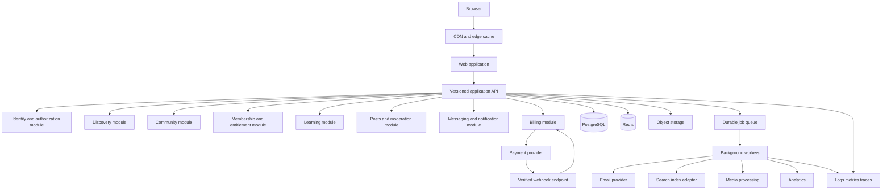

# SkillSpace Production System Architecture

## 1. Document Purpose

This document is the production architecture specification for the new SkillSpace prototype. It converts the review of the old prototype and the new prototype into implementation rules, boundaries, contracts, operating standards, and acceptance criteria.

The objective is to move the prototype from an estimated 5/10 architecture to a system that can reasonably be rated 10/10 against explicit engineering criteria, and to define the work required before production readiness can be rated 10/10.

A 10/10 rating in this document means:

- The architecture has clear ownership boundaries.
- Sensitive state is authoritative on the server.
- Important behavior is covered by automated tests.
- Failures are observable, recoverable, and safe.
- Performance, security, accessibility, and data integrity have measurable standards.
- The system can evolve without returning to a single-file application or uncontrolled global state.

This is a target architecture, not a claim that the current prototype is production-ready. Production readiness must be earned through implementation, verification, security review, load testing, and operational rehearsal.

## 2. Starting Point

### 2.1 Old prototype

The old prototype in `The SkillSpace - Copy` is a static browser application with:

- A large static `index.html` shell.
- Global JavaScript functions spread across `app.js`, `auth.js`, `profile.js`, and `settings.js`.
- Inline event handlers such as `onclick` and `onsubmit`.
- Multiple global mutable variables.
- Mock data exposed through browser globals.
- Client-owned users, sessions, and login attempts in `localStorage`.
- A large stylesheet with feature styles and later override layers mixed together.
- A broader set of visual product surfaces, including profile, settings, chat, notifications, and a create-community page.

Its feature files are useful evidence of product areas, but they are not safe architectural boundaries because every file depends on shared global state and browser-global functions.

### 2.2 New prototype

The new prototype improves the runtime shape with:

- A minimal HTML entry document.
- Vite and native ES modules.
- `src/main.js` as the application entry point.
- Imported data in `src/domain/data.js`.
- A local persistence adapter in `src/services/store.js`.
- A single application state object.
- Explicit render and bind phases.
- A successful production build.

The new prototype still has important architectural limitations:

- Most behavior remains in one large `src/main.js` module.
- Rendering, routing, authentication, persistence calls, and feature behavior are coupled.
- `store.js` is a `localStorage` wrapper rather than a validated repository or application service.
- Authentication and authorization are still client-owned.
- Routing is represented by an in-memory `state.view`, not URL routes.
- Domain values such as prices and member counts are display strings.
- Some old product surfaces were replaced by toasts or placeholders rather than migrated.
- The stylesheet contains repeated selector overrides from iterative visual changes.
- The architecture document in the two prototypes is currently the same document and therefore does not describe the new implementation specifically.

### 2.3 Architectural conclusion

The new prototype should remain a modular monolith first. It should not jump directly to microservices. The correct progression is:

1. Create real feature and domain boundaries in the web client.
2. Introduce typed and validated contracts.
3. Hide local persistence behind repository interfaces.
4. Introduce a versioned server API.
5. Move identity, permissions, membership, and money to server-authoritative storage.
6. Add background processing, search, media, and real-time capabilities as independently testable adapters.
7. Extract a service only after measured load, ownership, or deployment constraints justify it.

## 3. Architecture Goals and Non-Goals

### 3.1 Goals

The system must support:

- Public discovery of communities.
- Search, filtering, sorting, and pagination.
- Community detail pages with clear access and pricing information.
- Registration, login, logout, recovery, and session management.
- Profiles and account settings.
- Free and paid memberships.
- Community posts, comments, reactions, and moderation.
- Courses, lessons, and progress tracking.
- Events and reminders.
- Direct messaging and notifications.
- Creator community management.
- Affiliate attribution and creator payouts.
- Auditable payment and entitlement state.
- Accessible and responsive web workflows.
- Reliable deployments and observable operations.

### 3.2 Non-goals for the first production phase

The first production phase should not include these unless validated by product demand:

- Independent microservices for every domain.
- A dedicated search cluster before PostgreSQL search is measured to be insufficient.
- A custom payment processor.
- A custom video streaming platform.
- Fully open group chat with no moderation model.
- Real-time updates for every screen.
- A native mobile application before the web API contracts stabilize.
- Complex recommendation algorithms before basic discovery analytics exist.

## 4. 10/10 Architecture Rubric

The architecture is considered complete only when each area has an explicit owner, a stable contract, automated verification, and an operational failure plan.

### 4.1 Boundaries

- UI components do not access storage directly.
- Feature modules do not reach into another feature's private implementation.
- Domain rules do not depend on browser APIs.
- API handlers do not contain business rules.
- Repositories do not decide authorization.
- External providers are accessed through adapters.
- Cross-module communication uses application commands, queries, or events.

### 4.2 Data integrity

- All production data has a schema and migration history.
- Foreign keys and unique constraints protect relationships.
- Monetary values use integer minor units plus an explicit currency.
- Membership and entitlement changes are transactional.
- Payment webhooks are idempotent.
- Every sensitive mutation has an audit event.
- No critical authorization decision depends on local browser state.

### 4.3 Security

- Authentication is server-side.
- Passwords use Argon2id or an equivalent memory-hard password algorithm.
- Browser sessions use secure, HttpOnly, SameSite cookies or short-lived rotated tokens.
- Authorization is checked on every protected read and mutation.
- Rate limits are server-side.
- User-generated content is validated and safely rendered.
- Uploads are validated, scanned, transformed, and access-controlled.
- Secrets never enter source control or client bundles.

### 4.4 Testability

- Pure domain rules have unit tests.
- Repositories have integration tests.
- API contracts have contract tests.
- Critical journeys have browser end-to-end tests.
- Accessibility checks run in CI.
- Load tests cover discovery and authenticated workflows.
- Failure paths are tested, not only successful paths.

### 4.5 Operability

- Logs have request and correlation identifiers.
- Metrics cover latency, errors, queue depth, payment events, and authentication failures.
- Traces connect web requests, API calls, database work, and jobs.
- Alerts have owners and runbooks.
- Backups are automated and restore-tested.
- Deployments can be rolled back.
- Incident and disaster recovery exercises are documented.

## 5. Target System Shape



### 5.1 Deployment shape

Start with one deployable modular backend and one web application. The backend may run as a modular monolith with separate worker processes.

Recommended deployables:

- Web application.
- API application.
- Background worker.
- Scheduled job runner.
- PostgreSQL database.
- Redis instance where needed.
- Object storage bucket and CDN.

The modules should be logically isolated even while deployed together. A module may be extracted later behind its API or event contract without changing the web client.

### 5.2 Request flow

1. The browser requests a public page or an application API resource.
2. The edge layer serves cacheable public content where appropriate.
3. The web application requests typed data from the API.
4. The API authenticates the request and validates its input.
5. The application service checks resource-scoped authorization.
6. The domain operation reads and writes through repositories.
7. PostgreSQL commits the authoritative state.
8. An outbox record is written in the same transaction when asynchronous work is required.
9. A worker publishes notifications, updates search, processes media, or records analytics.
10. The API returns a stable success or error response.
11. Logs, metrics, and traces record the outcome without exposing secrets or sensitive content.

## 6. Web Application Architecture

### 6.1 Proposed source layout

```text
src/
  app/
    main.js
    app-state.js
    router.js
    render-app.js
    error-boundary.js
  components/
    Header.js
    Modal.js
    CommunityCard.js
    EmptyState.js
    LoadingState.js
    Toast.js
  features/
    discovery/
      discovery-view.js
      discovery-controller.js
      discovery-query.js
      discovery-api.js
    authentication/
      auth-view.js
      auth-controller.js
      auth-api.js
      auth-validation.js
    communities/
      community-detail-view.js
      community-controller.js
      community-api.js
    profile/
      profile-view.js
      profile-controller.js
      profile-api.js
    settings/
      settings-view.js
      settings-controller.js
      settings-api.js
    posts/
      post-list.js
      post-composer.js
      post-api.js
    messaging/
      chat-view.js
      notification-view.js
      messaging-api.js
  domain/
    community.js
    user.js
    membership.js
    post.js
    course.js
    money.js
    validation.js
  infrastructure/
    http-client.js
    local-storage-repository.js
    api-repositories.js
    analytics.js
    feature-flags.js
  styles/
    tokens.css
    base.css
    components.css
    features.css
```

The names are examples. The rule is that each feature owns its view, controller, validation, and API adapter. The application shell coordinates features but does not implement their business rules.

### 6.2 State ownership

State must be classified before it is stored:

- URL state: route, community slug, settings section, query parameters.
- Server state: communities, user profile, memberships, posts, notifications, payments.
- Session state: current authenticated identity and session status.
- Local UI state: modal visibility, open menu, selected tab, input draft.
- Derived state: filtered result count, unread count, membership eligibility.

The application must not duplicate server state in multiple mutable locations without an invalidation strategy. A successful mutation must either update the local cache deterministically or refetch the affected resource.

### 6.3 Rendering rules

- Use semantic elements for buttons, forms, navigation, dialogs, lists, and headings.
- Avoid inline event handlers.
- Avoid `onclick` attributes and browser-global feature functions.
- Avoid injecting untrusted values into HTML strings.
- Prefer component rendering with safe text nodes or a trusted templating system.
- Provide loading, empty, error, and success states for each server-backed view.
- Preserve user input when a request fails.
- Disable or deduplicate repeat submissions.
- Keep focus inside dialogs and restore focus when dialogs close.

### 6.4 Routing rules

Use real URL routes rather than only an in-memory `state.view`:

```text
/                         Discovery
/communities/:slug        Public community detail
/profile                  Current user profile
/settings/:section        Account settings
/login                    Login
/register                 Registration
```

Requirements:

- Browser back and forward must work.
- Refreshing a route must restore the same view.
- Community pages must have canonical URLs and metadata.
- Unknown routes must render a not-found state.
- Protected routes must redirect safely without losing the original destination.
- Query parameters must represent search, filters, sort, and pagination.

## 7. Domain Model

### 7.1 User

```text
User
- id: UUID
- email: normalized string, unique
- emailVerifiedAt: timestamp nullable
- displayName: string
- username: string, unique nullable
- bio: string nullable
- location: string nullable
- avatarMediaId: UUID nullable
- status: derived presence state
- createdAt: timestamp
- updatedAt: timestamp
- deletedAt: timestamp nullable
```

Authentication secrets, recovery tokens, and sessions must not be returned by ordinary user queries.

### 7.2 Community

```text
Community
- id: UUID
- slug: string, unique
- ownerUserId: UUID
- title: string
- description: string
- categoryId: UUID
- status: draft | review | published | suspended | archived
- accessPolicy: public | private | application_required
- coverMediaId: UUID nullable
- createdAt: timestamp
- publishedAt: timestamp nullable
- updatedAt: timestamp
```

The owner is not the same as a global administrator. Roles are scoped to a community.

### 7.3 Community membership

```text
Membership
- id: UUID
- communityId: UUID
- userId: UUID
- role: member | moderator | creator
- status: pending | active | paused | cancelled | banned
- planId: UUID nullable
- entitlementExpiresAt: timestamp nullable
- joinedAt: timestamp nullable
- leftAt: timestamp nullable
- createdAt: timestamp
- updatedAt: timestamp
```

A unique constraint on active membership identity must prevent accidental duplicate memberships. Membership status and payment status must not be inferred from client data.

### 7.4 Plans and money

```text
MembershipPlan
- id: UUID
- communityId: UUID
- name: string
- amountMinor: integer
- currency: ISO currency code
- interval: one_time | month | year
- active: boolean
- providerPriceId: string nullable

Payment
- id: UUID
- userId: UUID
- communityId: UUID
- provider: string
- providerPaymentId: string
- amountMinor: integer
- currency: ISO currency code
- status: pending | succeeded | failed | refunded | disputed
- createdAt: timestamp
```

Never store `$9 / month` as the only price representation. Display values must be derived from structured amounts.

### 7.5 Posts and moderation

```text
Post
- id: UUID
- communityId: UUID
- authorUserId: UUID
- body: validated rich text or plain text
- status: published | hidden | deleted | under_review
- createdAt: timestamp
- updatedAt: timestamp

Comment
- id: UUID
- postId: UUID
- parentCommentId: UUID nullable
- authorUserId: UUID
- body: validated text
- status: published | hidden | deleted
- createdAt: timestamp
- updatedAt: timestamp

ModerationAction
- id: UUID
- communityId: UUID
- actorUserId: UUID
- targetType: post | comment | user | community
- targetId: UUID
- action: hide | restore | warn | suspend | ban
- reason: string
- createdAt: timestamp
```

Content state must be explicit. Deleting an item from the UI must not erase audit evidence where retention policy requires it.

### 7.6 Learning

```text
Course
- id: UUID
- communityId: UUID
- title: string
- description: string
- status: draft | published | archived

Lesson
- id: UUID
- courseId: UUID
- title: string
- type: video | text | download | external
- position: integer
- requiredEntitlement: boolean
- publishedAt: timestamp nullable

LessonProgress
- userId: UUID
- lessonId: UUID
- completedAt: timestamp nullable
- resumePositionSeconds: integer
- updatedAt: timestamp
```

Progress is user- and lesson-scoped. It must not be stored as a single mutable level number without event or history support.

### 7.7 Notifications and messaging

```text
Conversation
- id: UUID
- type: direct | community
- createdAt: timestamp

ConversationParticipant
- conversationId: UUID
- userId: UUID
- lastReadAt: timestamp nullable

Message
- id: UUID
- conversationId: UUID
- senderUserId: UUID
- body: validated text
- createdAt: timestamp
- deletedAt: timestamp nullable

Notification
- id: UUID
- userId: UUID
- type: post | message | membership | payment | system
- payload: validated JSON
- readAt: timestamp nullable
- createdAt: timestamp
```

Unread counts are derived from server state or a cache that can be rebuilt. They must not be trusted from a browser badge.

## 8. Backend Module Boundaries

Each module must own its use cases, policies, repositories, database mappings, and events.

### 8.1 Identity module

Owns:

- Registration.
- Email verification.
- Login and logout.
- Password reset.
- Session rotation and revocation.
- Account deletion and export requests.
- Identity-provider integration later.

It must not decide whether a user can post or access a paid lesson.

### 8.2 Authorization module

Owns:

- Resource-scoped permission checks.
- Community roles.
- Platform roles.
- Moderation scope.
- Policy evaluation helpers.

Authorization must be checked in the application layer and enforced again at sensitive repository boundaries where practical.

### 8.3 Discovery module

Owns:

- Public community listing.
- Search query parsing.
- Category and price facets.
- Stable sorting.
- Cursor pagination.
- Trending calculation.
- Visibility filtering.

Only published communities that satisfy visibility rules may appear in public discovery.

### 8.4 Community module

Owns:

- Community creation.
- Draft and publication lifecycle.
- Branding and slug changes.
- Owner and moderator configuration.
- Community settings.
- Community archival and suspension.

### 8.5 Membership module

Owns:

- Join requests.
- Free membership activation.
- Paid membership entitlement.
- Private-community approval.
- Leave, cancellation, pause, ban, and reactivation.
- Entitlement checks.

This module is the authority for access to community resources.

### 8.6 Social module

Owns:

- Posts.
- Comments.
- Reactions.
- Bookmarks.
- Reports.
- Moderation actions.
- Content visibility.

### 8.7 Learning module

Owns:

- Courses.
- Sections and lessons.
- Publication state.
- Entitlement checks through the membership contract.
- Progress and completion.

### 8.8 Billing module

Owns:

- Plans.
- Checkout initiation.
- Provider customer references.
- Webhook verification.
- Payment state normalization.
- Refunds and cancellations.
- Creator revenue ledger.
- Payout state.

The billing module must never grant access solely because a checkout request was initiated. Access changes only after a verified provider result or approved free-membership operation.

### 8.9 Messaging and notification module

Owns:

- Conversation creation.
- Message permissions.
- Read state.
- In-app notification creation.
- Email notification jobs.
- User notification preferences.
- Delivery failure tracking.

## 9. API Contract

### 9.1 API rules

- Prefix public contracts with `/api/v1`.
- Validate every request at the boundary.
- Return one documented error shape.
- Use opaque identifiers rather than leaking internal database assumptions.
- Paginate every potentially large collection.
- Use idempotency keys for payment and other retryable mutations.
- Return authorization-safe representations.
- Version breaking changes.
- Generate or maintain an OpenAPI contract.

### 9.2 Example endpoints

```text
GET    /api/v1/communities
GET    /api/v1/communities/:slug
POST   /api/v1/communities
PATCH  /api/v1/communities/:id
POST   /api/v1/communities/:id/publish

POST   /api/v1/auth/register
POST   /api/v1/auth/login
POST   /api/v1/auth/logout
POST   /api/v1/auth/password-reset
GET    /api/v1/session

GET    /api/v1/me
PATCH  /api/v1/me/profile
GET    /api/v1/me/memberships
GET    /api/v1/me/notifications

POST   /api/v1/communities/:id/join
POST   /api/v1/communities/:id/checkout
DELETE /api/v1/communities/:id/membership

GET    /api/v1/communities/:id/posts
POST   /api/v1/communities/:id/posts
POST   /api/v1/posts/:id/comments
POST   /api/v1/posts/:id/reactions
POST   /api/v1/posts/:id/reports

GET    /api/v1/courses/:id
POST   /api/v1/lessons/:id/progress
GET    /api/v1/conversations
POST   /api/v1/conversations/:id/messages

POST   /api/v1/billing/webhooks/provider
```

### 9.3 Error shape

```json
{
  "error": {
    "code": "MEMBERSHIP_REQUIRED",
    "message": "You need an active membership to perform this action.",
    "requestId": "request-id"
  }
}
```

Messages may be user-friendly, but clients must branch on stable error codes rather than parsing prose.

## 10. Storage and Persistence

### 10.1 Development adapter

The prototype may keep a local adapter for offline visual development, but it must implement the same interface as the API-backed repository.

```js
communityRepository.list(query)
communityRepository.getBySlug(slug)
profileRepository.getCurrent()
profileRepository.update(changes)
postRepository.list(communityId, cursor)
postRepository.create(communityId, body)
```

The UI must depend on these interfaces, not on `localStorage` keys.

### 10.2 Production database

Use PostgreSQL as the transactional source of truth because the product has relational workflows involving:

- Users and identities.
- Community ownership.
- Role-scoped memberships.
- Plans and entitlements.
- Payments and refunds.
- Courses and progress.
- Moderation and audit records.

Required database practices:

- Migration files checked into source control.
- Foreign keys for owned relationships.
- Unique constraints for email, username, slug, provider event IDs, and active membership identity.
- Indexes designed from real query patterns.
- Explicit timestamps in UTC.
- Soft deletion only where product and retention policy require it.
- Transaction boundaries documented for money and access changes.
- Seed data separate from production data.

### 10.3 Cache rules

Redis may be used for:

- Short-lived discovery cache.
- Rate limiting.
- Distributed locks.
- Queue coordination.
- Presence and ephemeral unread counters.

Redis must not be the source of truth for:

- Payments.
- Membership status.
- Entitlements.
- User identity.
- Moderation history.

### 10.4 Outbox and jobs

When a database mutation needs asynchronous work, write the business mutation and an outbox event in one database transaction. A worker publishes or processes the event with retry and deduplication behavior.

Examples:

- User registered -> send verification email.
- Membership activated -> create welcome notification.
- Payment succeeded -> update entitlement and send receipt.
- Community published -> update discovery index.
- Media uploaded -> scan and generate image variants.

## 11. Authentication and Security

### 11.1 Authentication requirements

- Hash passwords on the server with Argon2id.
- Never send password hashes to the browser.
- Normalize and verify email addresses.
- Use secure, HttpOnly, SameSite cookies for browser sessions.
- Rotate session identifiers after login and privilege changes.
- Support session revocation by device.
- Expire recovery tokens quickly and only once.
- Rate-limit login, registration, recovery, and code-login requests.
- Use generic login failure messages to reduce account enumeration.
- Log security events without logging passwords or raw tokens.

### 11.2 Authorization requirements

Every protected operation must answer:

1. Who is the caller?
2. What resource is being accessed?
3. What role or entitlement does the caller have for that resource?
4. Is the resource in an allowed lifecycle state?
5. Is the operation allowed by policy?

Do not use a global `isAdmin` flag. A user can be a creator in one community, a moderator in another, and an ordinary member elsewhere.

### 11.3 Input and output safety

- Validate lengths, formats, enums, and relationships at the API boundary.
- Sanitize or safely render rich text.
- Encode output by default.
- Apply a Content Security Policy.
- Configure CORS narrowly.
- Add CSRF protection for cookie-authenticated mutations.
- Protect against request replay where money or sensitive mutations are involved.
- Never trust client-provided role, price, member count, owner ID, or entitlement fields.

### 11.4 Media safety

- Upload through a server-issued presigned URL.
- Validate file size and MIME type server-side.
- Do not trust the filename extension.
- Scan uploads for malware.
- Generate controlled image variants.
- Store media metadata in the database.
- Use signed delivery for private content.
- Use responsive image URLs and lazy loading.

## 12. Discovery Architecture

### 12.1 Query model

Discovery queries should support:

```text
q
category
accessPolicy
priceType
minPrice
maxPrice
sort=trending|top|newest
cursor
limit
```

The browser should serialize these values into the URL. The API should validate them and return:

```json
{
  "items": [],
  "nextCursor": null,
  "facets": {
    "categories": [],
    "priceRanges": []
  }
}
```

### 12.2 Search behavior

Initial search may use PostgreSQL full-text search over title, description, creator name, and category. Add a dedicated search system only when measurements show a need for typo tolerance, autocomplete, relevance tuning, or faceting at larger scale.

Search must:

- Normalize case and whitespace.
- Define minimum query length.
- Avoid unbounded wildcard scans.
- Use stable ranking and tie-breaking.
- Respect publication and visibility rules.
- Record search analytics without storing unnecessary personal data.

### 12.3 Sorting and trending

Member counts, revenue, and activity must be stored as structured numeric values. Trending must be a defined calculation, not a label that happens to preserve array order.

Document the initial formula and version it when it changes. Include a stable secondary sort so pagination does not duplicate or skip records.

## 13. Payments and Entitlements

### 13.1 Checkout flow

1. The browser requests checkout for a selected plan.
2. The API verifies the community and plan are active.
3. The API creates a provider checkout session using server-owned prices.
4. The browser completes payment with the provider.
5. The provider sends a signed webhook.
6. The webhook handler verifies the signature and deduplicates the event.
7. The billing module records payment state in a transaction.
8. The membership module activates or updates entitlement.
9. A notification and receipt job are queued.
10. The browser refreshes server state.

### 13.2 Rules

- Never trust a price from the browser.
- Never activate paid access from a client redirect alone.
- Store provider event IDs uniquely.
- Make webhook handling idempotent.
- Support refunds, disputes, cancellations, and failed renewals.
- Keep a revenue ledger separate from the current balance.
- Reconcile provider records with the database periodically.
- Audit manual adjustments.

## 14. Messaging and Notifications

### 14.1 Messaging

The first messaging release should define:

- Who can initiate a conversation.
- Whether membership is required.
- Blocking behavior.
- Reporting behavior.
- Message size and attachment limits.
- Read-state semantics.
- Retention and deletion rules.

Start with ordinary API polling or a managed realtime adapter. Do not make every screen depend on a custom websocket service before the message model and moderation model are stable.

### 14.2 Notifications

Notifications should be generated from domain events and delivered through separate channels:

- In-app inbox.
- Email.
- Push later.

Users need preferences, quiet hours, read state, and delivery failure visibility. Notification payloads must be validated and versioned so old records remain renderable after UI changes.

## 15. Accessibility and UX Quality

Production readiness includes usability for keyboard and assistive-technology users.

Required standards:

- Semantic headings in order.
- One clear page title per route.
- Labels associated with every form control.
- Visible focus indicators.
- Keyboard-operable menus, dialogs, tabs, and carousels.
- Correct dialog roles and focus management.
- Escape key behavior for dismissible overlays.
- Screen-reader announcements for errors, saves, new posts, and toast messages.
- Sufficient color contrast.
- No information conveyed by color alone.
- Reduced-motion behavior.
- Touch targets large enough for mobile use.
- No essential workflow hidden behind hover.
- Loading and error states that do not cause layout collapse.

## 16. CSS and Design System Architecture

The stylesheet should be reorganized into stable layers:

```text
styles/
  tokens.css       colors, spacing, type, radii, shadows
  reset.css        browser normalization
  base.css         body, typography, focus, forms
  layout.css       shell, grids, responsive containers
  components.css   buttons, cards, menus, dialogs, inputs
  features.css     discovery, profile, settings, detail pages
  utilities.css    small intentional utilities
```

Rules:

- Define each selector's primary behavior once.
- Avoid repeated later overrides for the same component.
- Use semantic tokens instead of scattered literal colors.
- Keep responsive rules next to the component they modify or in a clearly documented responsive layer.
- Do not let visual experimentation overwrite production states accidentally.
- Test narrow, medium, and wide viewports.
- Include disabled, focus, hover, error, loading, and empty states.

## 17. Testing Strategy

### 17.1 Unit tests

Cover pure behavior:

- Search query normalization.
- Category, price, and access filtering.
- Stable sorting.
- Cursor encoding and decoding.
- Money formatting.
- Membership eligibility.
- Role and permission policies.
- Progress calculations.
- Notification preference decisions.
- Input validation.

### 17.2 Integration tests

Cover module and repository boundaries:

- Registration and email verification state.
- Session creation, rotation, expiry, and revocation.
- Community publication rules.
- Free membership activation.
- Paid entitlement activation after a verified webhook.
- Private-community approval.
- Post creation and moderation.
- Profile updates persisting correctly.
- Notification creation through outbox processing.

### 17.3 Contract tests

Verify that web clients and API responses agree on:

- Success shapes.
- Error codes.
- Pagination.
- Enum values.
- Optional and nullable fields.
- Authentication failure behavior.

### 17.4 End-to-end tests

At minimum:

1. Visitor searches and filters communities.
2. Visitor opens a shareable community route.
3. Visitor registers and verifies the account.
4. Member joins a free community.
5. Member completes a lesson and sees progress.
6. Member creates a post and receives a notification.
7. Creator creates and publishes a community.
8. Paid checkout activates access only after a simulated verified webhook.
9. Moderator hides and restores reported content.
10. User updates profile and sees the update after refresh.
11. User logs out and protected routes are inaccessible.

### 17.5 Accessibility and visual tests

- Run automated accessibility checks in CI.
- Test keyboard-only navigation for all dialogs and menus.
- Add visual snapshots for discovery, detail, profile, settings, auth, loading, empty, and error states.
- Test desktop, tablet, and mobile viewport layouts.
- Use deterministic fixtures rather than random generated data in snapshots.

### 17.6 Load and resilience tests

Measure:

- Public discovery p95 latency.
- Search p95 latency.
- Authenticated profile reads.
- Post creation under concurrency.
- Notification queue throughput.
- Payment webhook retry behavior.
- Database connection pool utilization.
- Cache hit ratio.

Test degraded dependencies:

- Database slow or unavailable.
- Email provider unavailable.
- Payment provider delayed.
- Queue worker stopped.
- Search adapter unavailable.
- Object storage upload failure.

## 18. Observability and Operations

### 18.1 Logging

Use structured logs with:

- Timestamp.
- Severity.
- Service and module.
- Request ID.
- User ID when safe.
- Resource ID when safe.
- Operation name.
- Duration.
- Outcome and error code.

Do not log passwords, raw session tokens, payment secrets, full private messages, or unnecessary personal data.

### 18.2 Metrics

Track:

- Request count, error count, and latency by route.
- Authentication success and failure rates.
- Rate-limit events.
- Discovery result counts and empty searches.
- Membership activation and cancellation rates.
- Payment success, failure, refund, and webhook lag.
- Queue depth, retries, and dead letters.
- Database query latency and pool saturation.
- Media processing failures.
- Notification delivery success.

### 18.3 Alerts and runbooks

Every alert must state:

- What is broken.
- How severe it is.
- Who owns it.
- How to confirm the problem.
- How to mitigate it.
- How to recover.
- What follow-up is required.

### 18.4 Backup and recovery

- Automated encrypted database backups.
- Point-in-time recovery where supported.
- Restore testing at least quarterly.
- Documented recovery point objective.
- Documented recovery time objective.
- Object storage versioning and lifecycle rules.
- Recovery access tested independently of the primary credentials.

## 19. Delivery and CI/CD

### 19.1 Required checks for every change

- Formatting.
- Linting.
- Type checking.
- Unit tests.
- Integration tests for changed modules.
- API contract validation.
- Accessibility checks for changed UI.
- Production build.
- Dependency and secret scanning.

### 19.2 Deployment process

1. Build immutable artifacts.
2. Run migrations in a controlled, backward-compatible step.
3. Deploy the application.
4. Run smoke tests.
5. Monitor error and latency metrics.
6. Gradually enable risky features with flags.
7. Roll back application code if necessary.
8. Roll back data changes only through a tested migration strategy.

### 19.3 Environment separation

Maintain separate:

- Local development.
- Test or CI.
- Staging.
- Production.

Production data must never be copied into development without approved anonymization. Environment secrets must come from a secret manager or deployment platform, not checked-in files.

## 20. Migration Plan From the New Prototype

### Phase 0: Freeze the product contract

- Decide which old prototype surfaces are retained: chat, notifications, profile, settings, and community creation.
- Document route names and terminology.
- Convert random generated data into deterministic fixtures.
- Record the current prototype as a baseline visual and behavioral snapshot.

Exit criteria:

- Product surface inventory is approved.
- Baseline screenshots and smoke tests exist.
- No new feature is added directly to the monolithic entry file.

### Phase 1: Split the client monolith

- Move application state into `app-state.js`.
- Move route decisions into `router.js`.
- Move discovery into a feature module.
- Move auth and modal behavior into an authentication module.
- Move profile and settings into feature modules.
- Extract reusable header, card, modal, form, and empty-state components.
- Replace inline HTML event handlers with module listeners.

Exit criteria:

- `main.js` only composes the application.
- Each feature can be tested without rendering the entire application.
- No feature reads localStorage directly.

### Phase 2: Introduce contracts and repositories

- Define domain schemas and structured values.
- Create repository interfaces.
- Keep a local adapter for prototype mode.
- Add validation at repository boundaries.
- Synchronize profile updates, user records, and session identity.
- Add unit and integration tests.

Exit criteria:

- Price and member counts are structured.
- Profile updates survive refresh and subsequent login.
- Invalid stored data produces a recoverable error state.
- Tests cover filtering, auth, profile updates, and posts.

### Phase 3: Add the backend modular monolith

- Create the versioned API.
- Add PostgreSQL migrations.
- Add identity and session services.
- Add community and discovery endpoints.
- Add membership and post endpoints.
- Replace the local repository with an API repository behind the same interface.
- Add OpenAPI or generated schema contracts.

Exit criteria:

- The browser does not own authentication.
- A second browser sees the same community and post state.
- Protected API operations reject unauthorized requests.
- Database constraints prevent duplicate identity and membership records.

### Phase 4: Payments, media, jobs, and moderation

- Integrate the payment provider through a billing adapter.
- Implement verified idempotent webhooks.
- Add entitlement transactions.
- Add object storage and media processing.
- Add outbox events and workers.
- Add reports, moderation actions, and audit events.
- Add notification preferences and delivery tracking.

Exit criteria:

- Paid access is granted only from verified payment state.
- Webhook retries do not duplicate payments or entitlements.
- Private media cannot be fetched without authorization.
- Moderation actions are auditable.

### Phase 5: Production hardening

- Run accessibility review.
- Run load and resilience tests.
- Configure dashboards and alerts.
- Exercise backup restoration.
- Exercise rollback and incident procedures.
- Complete dependency, secret, and penetration reviews.
- Gradually release with feature flags.

Exit criteria:

- Production SLOs are measured and met.
- Critical journeys have automated end-to-end coverage.
- Recovery procedures work in rehearsal.
- On-call ownership is explicit.

## 21. Production Readiness Checklist

### Product and data

- [ ] User roles and permissions are documented.
- [ ] Community lifecycle states are implemented.
- [ ] Membership and entitlement rules are implemented.
- [ ] Pricing and currency are structured.
- [ ] Data retention and deletion policies are approved.
- [ ] Seed and fixture data are deterministic.

### Application

- [ ] URL routing supports refresh and browser navigation.
- [ ] Loading, empty, error, retry, and success states exist.
- [ ] No critical feature depends on a browser-global function.
- [ ] No critical feature reads localStorage directly.
- [ ] User-generated content is safely rendered.
- [ ] Client state cannot grant access.

### Security

- [ ] Server-side authentication is active.
- [ ] Passwords use a memory-hard hash.
- [ ] Sessions are secure, rotated, expirable, and revocable.
- [ ] Authorization is resource-scoped.
- [ ] CSRF, CORS, CSP, and rate limits are configured.
- [ ] Uploads are validated and scanned.
- [ ] Secrets are managed outside source control.
- [ ] Security events are audited.

### Payments

- [ ] Provider webhooks are signature-verified.
- [ ] Webhooks are idempotent.
- [ ] Payment states and entitlements are transactional.
- [ ] Refunds, cancellations, disputes, and failed renewals are handled.
- [ ] Reconciliation jobs exist.

### Quality

- [ ] Unit tests cover domain rules.
- [ ] Integration tests cover repositories and transactions.
- [ ] Contract tests validate API shapes.
- [ ] End-to-end tests cover critical user journeys.
- [ ] Accessibility tests run in CI.
- [ ] Load tests have been run against representative data.
- [ ] Dependency and secret scans pass.

### Operations

- [ ] Structured logs and request IDs are available.
- [ ] Metrics and traces cover critical workflows.
- [ ] Alerts have owners and runbooks.
- [ ] Backups are automated.
- [ ] Restore tests have passed.
- [ ] Rollback has been rehearsed.
- [ ] Incident response contacts are documented.
- [ ] SLOs, RPO, and RTO are measured rather than assumed.

## 22. Definition of Done for 10/10

The SkillSpace architecture may be rated 10/10 only when:

1. The web client is feature-oriented and no longer depends on a monolithic entry module.
2. The browser consumes stable, validated API contracts.
3. Identity, permissions, memberships, payments, and entitlements are server-authoritative.
4. PostgreSQL is the transactional source of truth.
5. External providers are isolated behind adapters and verified webhook flows.
6. Large collections are paginated and indexed.
7. User-generated content and media have safe handling paths.
8. Critical behavior has unit, integration, contract, end-to-end, and accessibility coverage.
9. Logs, metrics, traces, backups, alerts, runbooks, and rollback procedures are operational.
10. The team has demonstrated recovery from realistic failures.

Until those conditions are met, the system should be described as a prototype or staging system, regardless of how polished the interface looks.

## 23. Architectural Decision Summary

- Use a modular monolith first.
- Keep the new prototype's ES-module direction.
- Split the current entry module by feature and application responsibility.
- Use real URL routing.
- Represent domain values structurally, not as display strings.
- Put server state behind typed repository interfaces.
- Use PostgreSQL for transactional data.
- Use Redis only for ephemeral or coordination concerns.
- Use an outbox and durable workers for asynchronous work.
- Use a payment provider through a verified adapter.
- Treat memberships and entitlements as security-sensitive domain state.
- Preserve the useful product surfaces from the old prototype while replacing global implementation patterns.
- Measure before extracting services or adding specialized infrastructure.

This architecture gives SkillSpace a credible path from a visually convincing prototype to a secure, testable, observable, and maintainable production platform.
