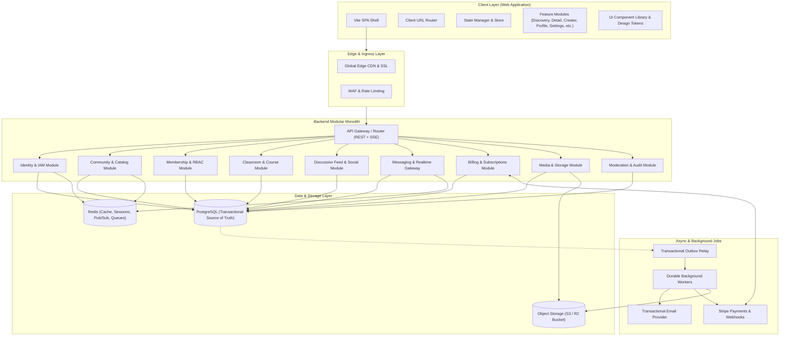
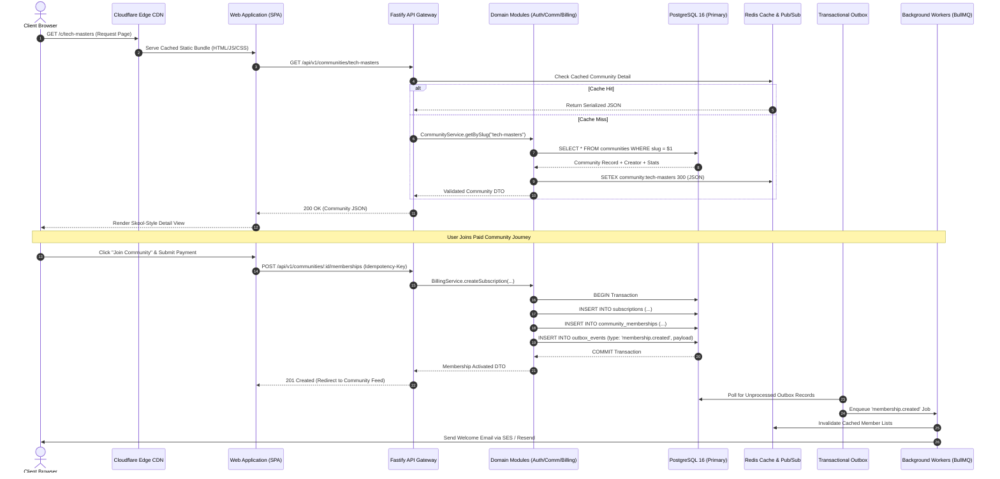
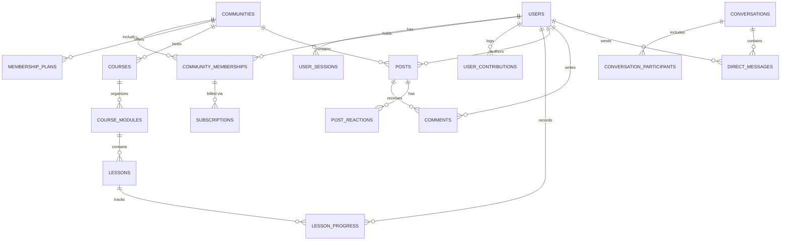
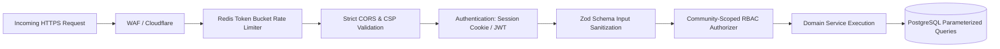
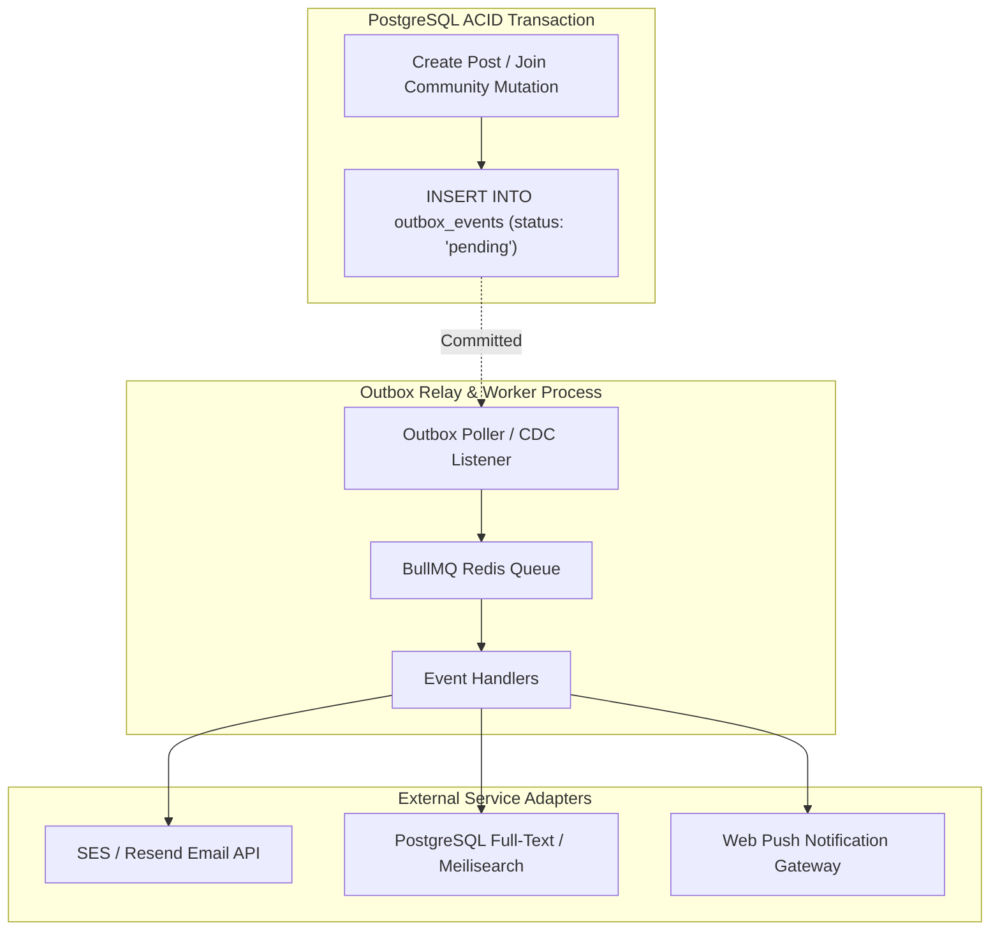
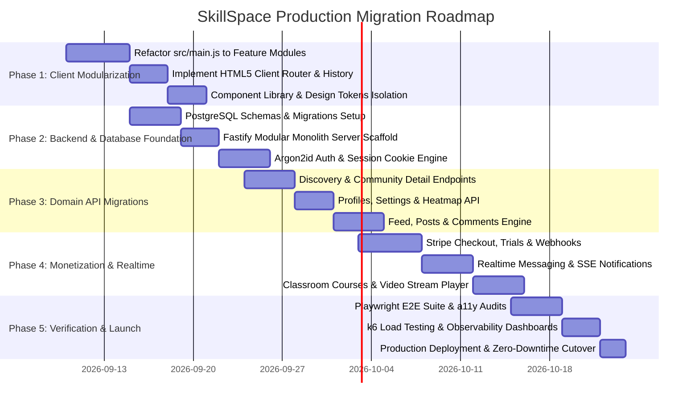

# SkillSpace System Architecture Specification (v2.0)

## 1. Executive Summary & Architectural Vision

### 1.1 Document Purpose
This document provides the definitive, production-grade system architecture specification for **SkillSpace**, derived directly from a comprehensive audit of the current prototype build. It bridges the gap between the existing single-page client-side prototype (`src/main.js`, `src/styles.css`, `src/domain/data.js`, `src/services/store.js`) and a robust, scalable, 10/10 production platform.

This specification serves as the single source of truth for:
- Refactoring the client-side monolith into a decoupled, domain-driven architecture.
- Designing and implementing the server-authoritative backend modular monolith.
- Defining strict data models, relational database schemas (PostgreSQL), and migration strategies.
- Establishing formal REST/SSE/WebSocket API contracts.
- Implementing zero-trust security, Role-Based Access Control (RBAC), and PCI-compliant billing.
- Guaranteeing performance, accessibility, automated testability, and operational observability.



---

### 1.2 Defining the 10/10 Production Standard
A **10/10 Engineering Rating** for SkillSpace mandates strict adherence to the following non-negotiable criteria:

1. **Clear Domain Boundaries**: UI components perform zero direct storage access or business logic; business rules reside in pure domain services; external providers (Stripe, S3, Email) are accessed strictly via pluggable adapters.
2. **Server Authority**: All sensitive state—including identity, sessions, permissions, memberships, community ownership, and money—is strictly validated and stored in ACID-compliant PostgreSQL transactions.
3. **Impenetrable Security**: Password hashing via Argon2id, HTTP-only SameSite secure session cookies, CSRF protection, community-scoped RBAC authorization on every endpoint, strict Content Security Policy (CSP), and automated sanitization against XSS.
4. **Resilient Data Integrity**: No financial value or member count is stored as a display string. Monetary amounts use integer minor units (cents) with explicit ISO currency codes; relational integrity is enforced by database foreign keys, constraints, and migrations.
5. **Comprehensive Verification**: 100% test coverage for pure domain logic, high-coverage repository integration tests, contract tests for third-party webhooks, automated Playwright E2E suites for core user journeys, and WCAG 2.1 AA accessibility compliance.
6. **Zero-Downtime Operability**: Structured JSON logging with trace/span correlation IDs (OpenTelemetry), sub-second Prometheus/Grafana metrics, automated WAL database backups, and blue-green zero-downtime deployment pipelines.

---

## 2. Current Prototype Build: Analysis & Inventory

### 2.1 Build & Runtime Topology
The current codebase operates as a high-fidelity client-side Single-Page Application (SPA):
- **Build Tooling**: Vite 5.x (`package.json`) compiling ES Modules (`src/main.js`, `src/styles.css`).
- **Entry HTML (`index.html`)**: Minimal HTML5 container mounting into `<div id="app"></div>` with `#101311` theme color.
- **Single-File Monolith (`src/main.js`)**: ~1,911 lines executing synchronous DOM generation, event binding, local storage manipulation, client-side SHA-256 password hashing, and in-memory view switching.
- **Fixture Data Layer (`src/domain/data.js`)**: 23.6 KB of curated mock fixtures for 24 communities, demo users, unread chat threads, notifications, and dynamic activity heatmaps.
- **Storage Layer (`src/services/store.js`)**: Synchronous `localStorage` facade managing users, active session tokens, community records, and feed posts.
- **Stylesheet (`src/styles.css`)**: 93.1 KB of comprehensive custom CSS defining design tokens, dark mode theming, glassmorphism, responsive breakpoints, micro-animations, and custom UI components.

---

### 2.2 Complete Surface & Feature Inventory

```text
┌──────────────────────────────────────────────────────────────────────────────────┐
│                             TOPBAR NAVIGATION                                    │
│ [Brand / Switcher ⌄] [Search Communities ⌕]      [Chats 💬] [Alerts 🔔] [Avatar] │
├──────────────────────────────────────────────────────────────────────────────────┤
│                                                                                  │
│  [ DISCOVER VIEW ]             [ DETAIL / ABOUT VIEW ]    [ CREATOR GROUP VIEW ] │
│  - Hero Banner                 - Star Rating & Reviews    - Group Setup Progress │
│  - Category Chips (10)         - Media Video Showcase     - Feed Toolbar & Topics│
│  - Price/Type/Sort Filters     - Interactive Thumbnails   - Post Composer        │
│  - Responsive Cards Grid       - Metadata Summary Bar     - Member Avatar Stack  │
│  - Dynamic Search Filtering    - Creator Information Card - Community Sidebar    │
│                                                                                  │
│  [ CREATE COMMUNITY ]          [ SELECT PLAN VIEW ]       [ USER PROFILE VIEW ]  │
│  - 3D Revenue Carousel         - Starter vs Pro Tiers     - Bio & Location Card  │
│  - Community Growth Metrics    - Monthly/Yearly Toggle    - 365-Day Activity Grid│
│  - Earning Projections         - 14-Day Free Trial CTA    - Memberships List     │
│                                                                                  │
│  [ SETTINGS SUITE ]            [ MODAL DIALOGS ]          [ SLIDE PANELS ]       │
│  - Profile Details             - Auth (Login / Register)  - Direct Messages Chat │
│  - Account & Credentials       - Plan Checkout (Trial/CC) - Notifications List   │
│  - Payments & Payouts          - Community Settings & Del - Community Switcher   │
│  - Affiliate Links & Stats     - Image Upload Pickers     - Filter Popup Dialog  │
│                                                                                  │
└──────────────────────────────────────────────────────────────────────────────────┘
```

#### 1. Global Navigation & Topbar
- **Brand & Community Switcher**: Wordmark dropdown showing all user-joined communities, avatar thumbnails, search filtering within joined communities, and quick actions ("Create a community", "Discover communities").
- **Global Search Bar**: Instant search input with clear button (`×`) that synchronizes query state across the application.
- **Direct Messaging Drawer**: Unread badge counter, user search filter, conversation list with timestamp and preview text, and "Mark all as read" capability.
- **Notifications Trigger**: Bell icon with unread count indicator triggering toast notifications and slide-out alerts.
- **Account Dropdown**: Authenticated user avatar displaying initial/pfp, email, navigation links (Profile, Settings, Affiliates, Language, Help Center, Discover, Log Out), and quick modal triggers for unauthenticated visitors.
- **Contextual Sub-Navigation Bar**: Dynamically displayed when inside a joined community, providing tabbed navigation across: *Community, Classroom, Calendar, Members, Map, Leaderboards, About*.

#### 2. Community Discovery (`discoverView`)
- **Hero Header**: High-impact banner ("A better place to belong - Discover communities").
- **Catalog Toolbar**: Full-width search bar with real-time text query filtering.
- **Category Navigation**: 10 curated categories (*Trending, Hobbies, Music, Money, Tech, Health, Sports, Self-improvement, Writing, Art*).
- **Advanced Filter Popup**: Multi-dimensional filtering across:
  - *Price*: All, Free, Paid.
  - *Access Type*: All, Private, Public.
  - *Sort Order*: Trending, Top (sorted by parsed member counts).
- **Community Grid**: Card components with custom accent glow (`--accent`), cover imagery, access type badge (open vs lock), member count badges, price badges, and hover transitions.
- **Zero-State Fallback**: Styled empty state with "Reset filters" action button.

#### 3. Community Detail & About Page (`detailView`)
- **Skool-Style Header**: Community title, 5-star golden rating badge, and review counter (e.g., `★ ★ ★ ★ ★ 5.0 · 93 reviews`).
- **Interactive Media Player Showcase**: Video viewport with custom play overlay, duration badge (`4:52`), and active presentation container.
- **Thumbnail Gallery Carousel**: 5-thumbnail image selector updating the primary media screen on click.
- **Professional Metadata Bar**: Semantic icons displaying Access Type, Member Count, Price model, and Creator Name.
- **About Copy & Bulleted Outcomes**: Detailed multi-paragraph value propositions and curriculum previews.
- **Creator Bio Card**: Creator avatar, role indicator, member stats, and direct contact options.
- **Review List & Pagination**: User reviews featuring author avatars, star ratings, relative timestamps, review copy, and "See more reviews" expansion.

#### 4. Creator Group & Community Portal (`creatorCommunityView`)
- **Post Composer**: Interactive text input prompt ("Write something") with creator avatar.
- **Feed Toolbar**: Topic filtering chips ("All", "General discussion") and feed layout options.
- **Group Setup Checklist**: Onboarding progress indicator tracking 4 milestones (*Invite 3 people, Add group description, Set cover image, Write your first post*).
- **Community Info Sidebar**: Cover preview, customized vanity URL (`skillspace.in/:slug`), private group indicator, real-time statistics (Members, Online now, Admins), and member avatar stack.
- **Settings Launcher**: Modal trigger for updating community metadata, photos, or deletion.

#### 5. Community Creation Landing (`createCommunityView`)
- **Hero & Conversion Copy**: "Build a community around your passion - Get discovered by 30 million users".
- **Interactive 3D Carousel**: 5-slide rotating deck showcasing top-earning communities with dynamic monthly revenue projections (calculated from member counts × price).
- **Carousel Controls**: Previous/Next chevron navigation, clickable dot pagination, and direct slide card selection.
- **Action CTA**: Primary button transitioning directly into the plan checkout funnel.

#### 6. Plan Selection & Pricing Matrix (`selectPlanView`)
- **Tier Cards**: Starter ($29/mo) vs Pro ($99/mo) pricing packages.
- **Billing Frequency Switcher**: Monthly vs Yearly toggle offering 20% annual discounts.
- **Feature Matrix**: Checklist detailing member limits, transaction fee percentages, video hosting allocations, and custom domain support.
- **Checkout Modal Trigger**: Action buttons opening the trial checkout modal with the pre-selected plan.

#### 7. Profile & Activity Surface (`profileView`)
- **User Banner & Profile Card**: Banner backdrop, large user avatar/initials, full name, handle, bio with 150-character counter, location, and join date.
- **GitHub-Style Contribution Heatmap**: Interactive 365-day SVG/CSS grid mapping activity levels (0 through 4), with mouseover tooltips displaying exact contribution counts and dates.
- **Contribution Community Filter**: Dropdown filtering activity by specific communities or "All communities".
- **Membership vs Created Tabs**: Toggleable list displaying user-joined communities vs communities created and managed by the user.

#### 8. Settings Suite (`settingsView`)
- **Profile Tab**: First name, last name, bio with live length counter, location, and avatar upload trigger.
- **Account Tab**: Email update trigger, password reset modal trigger, and global "Log out everywhere" action.
- **Payments Tab**: Saved credit card methods, payout account onboarding (Stripe Connect), and billing transaction history.
- **Notifications Tab**: Email digest toggles, direct message notifications, and community mention alerts.
- **Affiliates Tab**: Unique referral link generator, one-click clipboard copy button, commission rates (40% recurring), and earnings analytics.
- **Theme & Language Tab**: Light / Dark mode selector applying instantaneous CSS variables, and language localization dropdown.

#### 9. Modals & Dialog System
- **Auth Modal**: Tabbed Log In / Sign Up dialog, email/password validation, and SHA-256 password verification.
- **Plan Checkout Modal**: 14-day free trial banner, community name input, simulated credit card form (formatting card number, expiry, CVC), coupon code entry, and automated community generation into state.
- **Community Settings Modal**: Photo file inputs for icon/cover, title, description, privacy toggle, and community deletion.

---

## 3. Current Prototype Gaps vs. Production Standard (10/10)

| Architectural Dimension | Current Prototype Build | Target Production Standard (10/10) |
| :--- | :--- | :--- |
| **Code Structure & Modularity** | Single ~1,911 line `main.js` script containing rendering, event binding, routing, validation, and storage. | Decoupled feature modules, isolated domain models, pure presentational components, dedicated API clients, and application controllers. |
| **Routing & History** | Ephemeral `state.view` string variable. Page refresh resets state; browser back/forward buttons break. | HTML5 History API URL routing (`/discover`, `/c/:slug`, `/c/:slug/classroom`, `/profile`, `/settings/:tab`) with deep linking and SSR compatibility. |
| **Authentication & IAM** | Client-side SHA-256 hashing inside `main.js` evaluated against plain-text `localStorage` records. | Server-authoritative Argon2id password hashing, HTTP-only SameSite secure JWT/session cookies, refresh token rotation, and rate limiting. |
| **Authorization & RBAC** | UI checks hiding buttons or filtering arrays on the client (`isVisibleCommunity`). | Server-enforced Role-Based Access Control (Visitor, Member, Moderator, Creator, Admin) checked on every API route and database query. |
| **Data Integrity & Typing** | Unstructured display strings (`"$99/month"`, `"12.4k"`, `"Free trial"`). | Strongly-typed relational entities: integer minor units (`amount_cents: 9900`, `currency: 'USD'`), BigInt counts, and strict database foreign key constraints. |
| **Persistence & Transactions** | Unreliable synchronous `localStorage` facade in `store.js` susceptible to data loss, quota limits, and race conditions. | PostgreSQL 16+ relational database with ACID transactions, WAL logging, connection pooling (PgBouncer), and automated migrations. |
| **Billing & Payments** | Mock form fields saving fake community entries directly to browser storage. | Stripe Billing & Stripe Connect integration, PCI-DSS SAQ A compliance, idempotent webhook processing, and ledger-backed subscriptions. |
| **Media & File Storage** | File input triggers without backend upload endpoints; Unsplash/placeholder image URLs. | Direct-to-S3/R2 presigned upload pipeline, MIME/magic-byte validation, virus scanning, Sharp image resizing, and Cloudflare CDN delivery. |
| **Realtime Infrastructure** | Static arrays in `data.js` with simulated mark-as-read actions. | WebSocket / Server-Sent Events (SSE) gateway backed by Redis Pub/Sub for instant direct messages, notifications, and live post reactions. |
| **Async Processing** | Zero background task processing; all execution occurs on the main browser thread. | Transactional Outbox pattern paired with durable background queues (BullMQ / Redis) for emails, media processing, and search indexing. |
| **Automated Verification** | Zero automated tests (no unit, integration, contract, or E2E tests). | Vitest unit/integration tests, Playwright E2E suites for all core user journeys, API contract tests, and automated axe-core accessibility CI checks. |
| **Observability** | `console.log` and UI toasts. | OpenTelemetry distributed tracing, structured JSON logging with correlation IDs, Prometheus metric endpoints, and Grafana alerting dashboards. |

---

## 4. Target Modular Monolith Architecture

### 4.1 System Topology & Request Flow



---

### 4.2 Module Boundaries & Responsibilities

The backend is architected as a **Modular Monolith** where each domain is completely isolated behind an explicit public API service interface:

1. **Identity & IAM Module (`modules/identity`)**: User registration, Argon2id authentication, session issuance, refresh token rotation, email verification, password reset tokens, and MFA.
2. **Community & Catalog Module (`modules/community`)**: Community lifecycle, vanity slugs, categories, discovery indexing, search query filters, and community settings.
3. **Membership & RBAC Module (`modules/membership`)**: Community memberships, role assignments (Visitor, Member, Moderator, Creator, Admin), permission evaluations, member directories, and ban enforcement.
4. **Classroom & Learning Module (`modules/classroom`)**: Courses, modules, lessons (video/text/downloadable), attachment security, and user lesson completion tracking.
5. **Discussion Feed & Social Module (`modules/social`)**: Post publication, rich text formatting, comments, nested replies, pinned announcements, and emoji reactions.
6. **Messaging & Realtime Gateway (`modules/messaging`)**: 1-on-1 direct messaging, conversation threads, presence indicators, unread counters, and WebSocket/SSE broadcast connections.
7. **Billing & Subscriptions Module (`modules/billing`)**: Stripe customer synchronization, checkout sessions, subscription lifecycles, 14-day free trials, affiliate tracking, invoice history, and creator payouts via Stripe Connect.
8. **Media & Storage Module (`modules/media`)**: Presigned S3 upload generation, MIME/magic byte validation, image optimization pipelines, and Cloudflare CDN asset delivery.
9. **Moderation, Trust & Safety Module (`modules/moderation`)**: User/post reporting flags, moderation action logs, content filtering, rate limiting, and immutable audit trails.

---

## 5. Client Architecture (Refactoring `src/main.js`)

### 5.1 Modular Source Code Layout
To eliminate the 1,911-line single-file bottleneck in `src/main.js`, the client codebase is restructured into feature-oriented, domain-driven modules:

```text
src/
├── app/
│   ├── app.js                   # Application bootstrap & lifecycle coordinator
│   ├── router.js                # HTML5 History API client router & route guards
│   ├── state.js                 # Reactive centralized store & state selectors
│   ├── events.js                # Global event emitter for cross-feature signals
│   └── error-boundary.js        # Global unhandled error & rejection handler
│
├── components/                  # Reusable, stateless UI design components
│   ├── layout/
│   │   ├── Header.js            # Topbar navigation, brand switcher, and search
│   │   ├── SubNav.js            # Community tabbed subnavigation bar
│   │   └── Modal.js             # Accessible dialog container (focus trap, ARIA)
│   ├── cards/
│   │   ├── CommunityCard.js     # Discovery grid community card with accent glow
│   │   └── ReviewCard.js        # Star rating & review card component
│   ├── feedback/
│   │   ├── Toast.js             # Animated transient notification alerts
│   │   ├── Skeleton.js          # Shimmer loading skeleton placeholders
│   │   └── EmptyState.js        # Configurable empty state with action buttons
│   └── forms/
│       ├── Button.js            # Primary, secondary, outline, and ghost buttons
│       ├── Input.js             # Text input with validation and character counters
│       └── RadioGroup.js        # Styled custom radio buttons for filter dialogs
│
├── features/                    # Feature modules (View + Controller + API Adapter)
│   ├── discovery/               # Public community catalog & advanced filters
│   │   ├── discovery.view.js
│   │   ├── discovery.controller.js
│   │   └── discovery.api.js
│   ├── community-detail/        # Skool-style sales & about presentation page
│   │   ├── detail.view.js
│   │   ├── gallery.controller.js
│   │   └── detail.api.js
│   ├── creator-group/           # Creator community portal, onboarding, & feed
│   │   ├── creator.view.js
│   │   ├── checklist.controller.js
│   │   └── feed.api.js
│   ├── create-community/        # 3D carousel growth page & plan checkout
│   │   ├── create.view.js
│   │   ├── carousel.controller.js
│   │   └── checkout.api.js
│   ├── profile/                 # User profile & 365-day activity heatmap
│   │   ├── profile.view.js
│   │   ├── heatmap.controller.js
│   │   └── profile.api.js
│   ├── settings/                # Multi-tab settings suite & theme manager
│   │   ├── settings.view.js
│   │   ├── settings.controller.js
│   │   └── settings.api.js
│   ├── messaging/               # Direct message chat drawer & unread manager
│   │   ├── chat-drawer.view.js
│   │   ├── chat.controller.js
│   │   └── chat.socket.js
│   └── auth/                    # Login, signup, and password reset dialogs
│       ├── auth-modal.view.js
│       ├── auth.controller.js
│       └── auth.api.js
│
├── domain/                      # Pure business logic, types, & validation rules
│   ├── community.model.js       # Community entity rules & pricing calculations
│   ├── user.model.js            # User profile models & permission checks
│   ├── money.vo.js              # Value object for currency minor units & formatting
│   └── validation.js            # Client-side validation schemas (Zod / custom)
│
├── infrastructure/              # Low-level external communication adapters
│   ├── http-client.js           # Fetch wrapper with interceptors, JWT, & retries
│   ├── sse-client.js            # Server-Sent Events subscriber with auto-reconnect
│   ├── storage-repository.js    # IndexedDB / LocalStorage client cache fallback
│   └── logger.js                # Structured browser telemetry and error logger
│
└── styles/                      # Modular CSS architecture
    ├── tokens.css               # Color variables, typography, spacing, shadows
    ├── base.css                 # Reset, typography, layout containers
    ├── components.css           # Buttons, cards, modals, form inputs, heatmaps
    ├── dark-theme.css           # Dark mode overrides (`.theme-dark`)
    └── animations.css           # Keyframes, slide transitions, and carousel 3D
```

---

### 5.2 Client-Side URL Routing Specification

The router replaces in-memory `state.view` switching with standard browser History routing:

| Route Pattern | Feature Module | Access Policy | Page Title & Metadata |
| :--- | :--- | :--- | :--- |
| `/` or `/discover` | `features/discovery` | Public | "Discover Communities \| SkillSpace" |
| `/c/:slug` | `features/community-detail` | Public | ":communityTitle \| SkillSpace" |
| `/c/:slug/about` | `features/community-detail` | Public | "About :communityTitle \| SkillSpace" |
| `/c/:slug/feed` | `features/creator-group` | Member Only | "Community Feed \| :communityTitle" |
| `/c/:slug/classroom` | `features/classroom` | Member Only | "Classroom \| :communityTitle" |
| `/c/:slug/classroom/:lessonId`| `features/classroom` | Member Only | ":lessonTitle \| :communityTitle" |
| `/c/:slug/members` | `features/community-members`| Member Only | "Members \| :communityTitle" |
| `/c/:slug/settings` | `features/community-settings`| Creator / Admin | "Group Settings \| :communityTitle" |
| `/create` | `features/create-community` | Public / Auth | "Create a Community \| SkillSpace" |
| `/create/plan` | `features/create-community` | Public / Auth | "Select a Plan \| SkillSpace" |
| `/profile` or `/u/:username` | `features/profile` | Public / Auth | ":displayName \| SkillSpace" |
| `/settings` | `features/settings` (Profile) | Authenticated | "Account Settings \| SkillSpace" |
| `/settings/:tab` | `features/settings` (:tab) | Authenticated | ":tab Settings \| SkillSpace" |
| `/login` | `features/auth` (Modal) | Visitor Only | "Log In \| SkillSpace" |
| `/register` | `features/auth` (Modal) | Visitor Only | "Sign Up \| SkillSpace" |

---

## 6. Database Schema & Relational Specifications (PostgreSQL)

The database schema is modeled in PostgreSQL 16+ using strict constraints, indexes, foreign keys, and UUIDv7 primary keys for chronological ordering and high-throughput inserts.



### 6.1 Core PostgreSQL DDL Schema

```sql
-- Enable necessary extensions
CREATE EXTENSION IF NOT EXISTS "uuid-ossp";
CREATE EXTENSION IF NOT EXISTS "pgcrypto";

-- Enum Definitions
CREATE TYPE access_policy_enum AS ENUM ('public', 'private', 'application_required');
CREATE TYPE community_status_enum AS ENUM ('draft', 'published', 'suspended', 'archived');
CREATE TYPE member_role_enum AS ENUM ('visitor', 'member', 'moderator', 'admin', 'creator');
CREATE TYPE member_status_enum AS ENUM ('pending', 'active', 'paused', 'cancelled', 'banned');
CREATE TYPE billing_interval_enum AS ENUM ('one_time', 'month', 'year');
CREATE TYPE subscription_status_enum AS ENUM ('trialing', 'active', 'past_due', 'canceled', 'unpaid');
CREATE TYPE lesson_type_enum AS ENUM ('video', 'rich_text', 'download', 'quiz');
CREATE TYPE post_status_enum AS ENUM ('published', 'hidden', 'deleted', 'under_review');
CREATE TYPE media_type_enum AS ENUM ('avatar', 'cover', 'video_playback', 'attachment');

-- 1. USERS TABLE
CREATE TABLE users (
    id UUID PRIMARY KEY DEFAULT gen_random_uuid(),
    email VARCHAR(255) NOT NULL UNIQUE,
    email_verified_at TIMESTAMPTZ,
    password_hash VARCHAR(255) NOT NULL,
    display_name VARCHAR(100) NOT NULL,
    username VARCHAR(50) UNIQUE,
    bio VARCHAR(150),
    location VARCHAR(100),
    avatar_url TEXT,
    banner_url TEXT,
    theme_mode VARCHAR(10) DEFAULT 'light' CHECK (theme_mode IN ('light', 'dark')),
    is_platform_admin BOOLEAN DEFAULT FALSE NOT NULL,
    created_at TIMESTAMPTZ DEFAULT CURRENT_TIMESTAMP NOT NULL,
    updated_at TIMESTAMPTZ DEFAULT CURRENT_TIMESTAMP NOT NULL,
    deleted_at TIMESTAMPTZ
);

CREATE INDEX idx_users_email ON users(email);
CREATE INDEX idx_users_username ON users(username);

-- 2. USER SESSIONS TABLE
CREATE TABLE user_sessions (
    id UUID PRIMARY KEY DEFAULT gen_random_uuid(),
    user_id UUID NOT NULL REFERENCES users(id) ON DELETE CASCADE,
    refresh_token_hash VARCHAR(255) NOT NULL UNIQUE,
    user_agent TEXT,
    ip_address INET,
    expires_at TIMESTAMPTZ NOT NULL,
    created_at TIMESTAMPTZ DEFAULT CURRENT_TIMESTAMP NOT NULL
);

CREATE INDEX idx_sessions_user ON user_sessions(user_id);
CREATE INDEX idx_sessions_expires ON user_sessions(expires_at);

-- 3. CATEGORIES TABLE
CREATE TABLE categories (
    id UUID PRIMARY KEY DEFAULT gen_random_uuid(),
    name VARCHAR(50) NOT NULL UNIQUE,
    slug VARCHAR(50) NOT NULL UNIQUE,
    display_order INT DEFAULT 0 NOT NULL
);

-- 4. COMMUNITIES TABLE
CREATE TABLE communities (
    id UUID PRIMARY KEY DEFAULT gen_random_uuid(),
    owner_id UUID NOT NULL REFERENCES users(id) ON DELETE RESTRICT,
    category_id UUID NOT NULL REFERENCES categories(id) ON DELETE RESTRICT,
    title VARCHAR(120) NOT NULL,
    slug VARCHAR(80) NOT NULL UNIQUE,
    tagline VARCHAR(150),
    description TEXT,
    about_markdown TEXT,
    access_policy access_policy_enum DEFAULT 'public' NOT NULL,
    status community_status_enum DEFAULT 'published' NOT NULL,
    cover_image_url TEXT,
    icon_image_url TEXT,
    accent_color VARCHAR(10) DEFAULT '#6366f1' NOT NULL,
    rating_average NUMERIC(3, 2) DEFAULT 5.00 NOT NULL,
    review_count INT DEFAULT 0 NOT NULL,
    member_count INT DEFAULT 1 NOT NULL,
    created_at TIMESTAMPTZ DEFAULT CURRENT_TIMESTAMP NOT NULL,
    updated_at TIMESTAMPTZ DEFAULT CURRENT_TIMESTAMP NOT NULL
);

CREATE INDEX idx_communities_slug ON communities(slug);
CREATE INDEX idx_communities_category ON communities(category_id);
CREATE INDEX idx_communities_owner ON communities(owner_id);
CREATE INDEX idx_communities_discovery ON communities(status, access_policy, member_count DESC);

-- 5. MEMBERSHIP PLANS & PRICING
CREATE TABLE membership_plans (
    id UUID PRIMARY KEY DEFAULT gen_random_uuid(),
    community_id UUID NOT NULL REFERENCES communities(id) ON DELETE CASCADE,
    name VARCHAR(100) NOT NULL,
    description TEXT,
    amount_cents INT NOT NULL CHECK (amount_cents >= 0),
    currency VARCHAR(3) DEFAULT 'USD' NOT NULL,
    billing_interval billing_interval_enum DEFAULT 'month' NOT NULL,
    trial_days INT DEFAULT 0 NOT NULL,
    is_active BOOLEAN DEFAULT TRUE NOT NULL,
    stripe_price_id VARCHAR(100),
    created_at TIMESTAMPTZ DEFAULT CURRENT_TIMESTAMP NOT NULL
);

CREATE INDEX idx_plans_community ON membership_plans(community_id);

-- 6. COMMUNITY MEMBERSHIPS
CREATE TABLE community_memberships (
    id UUID PRIMARY KEY DEFAULT gen_random_uuid(),
    community_id UUID NOT NULL REFERENCES communities(id) ON DELETE CASCADE,
    user_id UUID NOT NULL REFERENCES users(id) ON DELETE CASCADE,
    role member_role_enum DEFAULT 'member' NOT NULL,
    status member_status_enum DEFAULT 'active' NOT NULL,
    current_plan_id UUID REFERENCES membership_plans(id) ON DELETE SET NULL,
    joined_at TIMESTAMPTZ DEFAULT CURRENT_TIMESTAMP NOT NULL,
    expires_at TIMESTAMPTZ,
    created_at TIMESTAMPTZ DEFAULT CURRENT_TIMESTAMP NOT NULL,
    updated_at TIMESTAMPTZ DEFAULT CURRENT_TIMESTAMP NOT NULL,
    CONSTRAINT uq_user_community UNIQUE(community_id, user_id)
);

CREATE INDEX idx_memberships_community ON community_memberships(community_id, status);
CREATE INDEX idx_memberships_user ON community_memberships(user_id);

-- 7. COURSES & CLASSROOM
CREATE TABLE courses (
    id UUID PRIMARY KEY DEFAULT gen_random_uuid(),
    community_id UUID NOT NULL REFERENCES communities(id) ON DELETE CASCADE,
    title VARCHAR(150) NOT NULL,
    description TEXT,
    cover_image_url TEXT,
    display_order INT DEFAULT 0 NOT NULL,
    is_published BOOLEAN DEFAULT FALSE NOT NULL,
    created_at TIMESTAMPTZ DEFAULT CURRENT_TIMESTAMP NOT NULL,
    updated_at TIMESTAMPTZ DEFAULT CURRENT_TIMESTAMP NOT NULL
);

CREATE TABLE course_modules (
    id UUID PRIMARY KEY DEFAULT gen_random_uuid(),
    course_id UUID NOT NULL REFERENCES courses(id) ON DELETE CASCADE,
    title VARCHAR(150) NOT NULL,
    display_order INT DEFAULT 0 NOT NULL
);

CREATE TABLE lessons (
    id UUID PRIMARY KEY DEFAULT gen_random_uuid(),
    module_id UUID NOT NULL REFERENCES course_modules(id) ON DELETE CASCADE,
    title VARCHAR(150) NOT NULL,
    lesson_type lesson_type_enum DEFAULT 'video' NOT NULL,
    video_playback_id TEXT,
    video_duration_seconds INT DEFAULT 0,
    content_markdown TEXT,
    display_order INT DEFAULT 0 NOT NULL,
    is_free_preview BOOLEAN DEFAULT FALSE NOT NULL,
    created_at TIMESTAMPTZ DEFAULT CURRENT_TIMESTAMP NOT NULL
);

CREATE TABLE lesson_progress (
    user_id UUID NOT NULL REFERENCES users(id) ON DELETE CASCADE,
    lesson_id UUID NOT NULL REFERENCES lessons(id) ON DELETE CASCADE,
    completed_at TIMESTAMPTZ,
    last_position_seconds INT DEFAULT 0,
    updated_at TIMESTAMPTZ DEFAULT CURRENT_TIMESTAMP NOT NULL,
    PRIMARY KEY (user_id, lesson_id)
);

-- 8. POSTS & DISCUSSIONS
CREATE TABLE posts (
    id UUID PRIMARY KEY DEFAULT gen_random_uuid(),
    community_id UUID NOT NULL REFERENCES communities(id) ON DELETE CASCADE,
    author_id UUID NOT NULL REFERENCES users(id) ON DELETE CASCADE,
    title VARCHAR(200),
    body_markdown TEXT NOT NULL,
    status post_status_enum DEFAULT 'published' NOT NULL,
    is_pinned BOOLEAN DEFAULT FALSE NOT NULL,
    comment_count INT DEFAULT 0 NOT NULL,
    like_count INT DEFAULT 0 NOT NULL,
    created_at TIMESTAMPTZ DEFAULT CURRENT_TIMESTAMP NOT NULL,
    updated_at TIMESTAMPTZ DEFAULT CURRENT_TIMESTAMP NOT NULL
);

CREATE INDEX idx_posts_community_feed ON posts(community_id, is_pinned DESC, created_at DESC);

CREATE TABLE comments (
    id UUID PRIMARY KEY DEFAULT gen_random_uuid(),
    post_id UUID NOT NULL REFERENCES posts(id) ON DELETE CASCADE,
    parent_comment_id UUID REFERENCES comments(id) ON DELETE CASCADE,
    author_id UUID NOT NULL REFERENCES users(id) ON DELETE CASCADE,
    body TEXT NOT NULL,
    status post_status_enum DEFAULT 'published' NOT NULL,
    created_at TIMESTAMPTZ DEFAULT CURRENT_TIMESTAMP NOT NULL
);

CREATE INDEX idx_comments_post ON comments(post_id, created_at ASC);

-- 9. USER CONTRIBUTIONS (HEATMAP ENGINE)
CREATE TABLE user_contributions (
    id UUID PRIMARY KEY DEFAULT gen_random_uuid(),
    user_id UUID NOT NULL REFERENCES users(id) ON DELETE CASCADE,
    community_id UUID REFERENCES communities(id) ON DELETE CASCADE,
    activity_type VARCHAR(50) NOT NULL, -- 'post', 'comment', 'lesson_complete'
    activity_date DATE NOT NULL,
    created_at TIMESTAMPTZ DEFAULT CURRENT_TIMESTAMP NOT NULL
);

CREATE INDEX idx_contributions_user_date ON user_contributions(user_id, activity_date);

-- 10. DIRECT MESSAGES & REALTIME CHAT
CREATE TABLE conversations (
    id UUID PRIMARY KEY DEFAULT gen_random_uuid(),
    created_at TIMESTAMPTZ DEFAULT CURRENT_TIMESTAMP NOT NULL,
    updated_at TIMESTAMPTZ DEFAULT CURRENT_TIMESTAMP NOT NULL
);

CREATE TABLE conversation_participants (
    conversation_id UUID NOT NULL REFERENCES conversations(id) ON DELETE CASCADE,
    user_id UUID NOT NULL REFERENCES users(id) ON DELETE CASCADE,
    last_read_at TIMESTAMPTZ,
    PRIMARY KEY (conversation_id, user_id)
);

CREATE TABLE direct_messages (
    id UUID PRIMARY KEY DEFAULT gen_random_uuid(),
    conversation_id UUID NOT NULL REFERENCES conversations(id) ON DELETE CASCADE,
    sender_id UUID NOT NULL REFERENCES users(id) ON DELETE CASCADE,
    body TEXT NOT NULL,
    created_at TIMESTAMPTZ DEFAULT CURRENT_TIMESTAMP NOT NULL
);

CREATE INDEX idx_messages_conversation ON direct_messages(conversation_id, created_at DESC);

-- 11. TRANSACTIONAL OUTBOX TABLE
CREATE TABLE outbox_events (
    id UUID PRIMARY KEY DEFAULT gen_random_uuid(),
    event_type VARCHAR(100) NOT NULL,
    aggregate_type VARCHAR(50) NOT NULL,
    aggregate_id UUID NOT NULL,
    payload JSONB NOT NULL,
    status VARCHAR(20) DEFAULT 'pending' NOT NULL CHECK (status IN ('pending', 'processing', 'completed', 'failed')),
    retry_count INT DEFAULT 0 NOT NULL,
    last_error TEXT,
    created_at TIMESTAMPTZ DEFAULT CURRENT_TIMESTAMP NOT NULL,
    processed_at TIMESTAMPTZ
);

CREATE INDEX idx_outbox_pending ON outbox_events(status, created_at ASC) WHERE status = 'pending';
```

---

## 7. Versioned API Contracts & Real-Time Specifications

### 7.1 Standard RESTful Endpoints (`/api/v1`)

All REST endpoints follow standard JSON request/response conventions and use standard RFC 7807 problem details for errors.

#### Authentication & Sessions
- `POST /api/v1/auth/register`: Create user account and issue session cookies.
- `POST /api/v1/auth/login`: Authenticate email/password via Argon2id.
- `POST /api/v1/auth/refresh`: Rotate refresh token and issue new access token.
- `POST /api/v1/auth/logout`: Revoke active session token.
- `POST /api/v1/auth/logout-all`: Invalidate all active sessions for user.

#### Community Catalog & Discovery
- `GET /api/v1/communities`: Query paginated communities with filters (`category`, `price_type`, `access_policy`, `sort`, `q`, `page`, `limit`).
- `GET /api/v1/communities/:slug`: Retrieve full public community details, ratings, media gallery, and creator metadata.
- `POST /api/v1/communities`: Create new community (requires active subscription or trial entitlement).
- `PATCH /api/v1/communities/:id`: Update community settings (Title, Slug, Cover, Icon, Description).
- `DELETE /api/v1/communities/:id`: Soft-delete community and cancel active billing.

#### Memberships & Billing
- `POST /api/v1/communities/:id/join`: Join free/public community.
- `POST /api/v1/communities/:id/checkout`: Initialize Stripe checkout session for paid community.
- `POST /api/v1/communities/:id/leave`: Cancel membership in community.
- `GET /api/v1/memberships/me`: List all communities joined/owned by current user.
- `POST /api/v1/webhooks/stripe`: Idempotent Stripe webhook receiver.

#### Classroom & Courses
- `GET /api/v1/communities/:id/courses`: List courses and modules for a community.
- `GET /api/v1/lessons/:id`: Fetch lesson video stream URL or markdown content (verified against user membership).
- `POST /api/v1/lessons/:id/progress`: Record user progress or mark lesson completed.

#### Social & Discussion Feed
- `GET /api/v1/communities/:id/posts`: Paginated community feed filtered by topic.
- `POST /api/v1/communities/:id/posts`: Publish post with rich text and attachment IDs.
- `POST /api/v1/posts/:id/comments`: Add comment to post.
- `POST /api/v1/posts/:id/reactions`: Toggle emoji reaction on post.

#### Profile & Contributions
- `GET /api/v1/users/:username`: Fetch public user profile and bio.
- `GET /api/v1/users/:username/contributions?community_id=all`: Fetch 365-day contribution heatmap array (`[{ date: '2026-03-01', count: 4, level: 2 }]`).
- `PATCH /api/v1/users/me`: Update profile details (Name, Bio, Location, Avatar).

---

### 7.2 Real-Time Events (Server-Sent Events / WebSocket)

SkillSpace utilizes Server-Sent Events (SSE) for downstream client updates and WebSockets for low-latency bidirectional chat:

```text
Event: chat.message_created
Data: {
  "conversationId": "c39a832e-...",
  "messageId": "m91823a-...",
  "sender": { "id": "u18...", "name": "Sarah Connor", "avatar": "https://..." },
  "body": "Welcome to the group!",
  "createdAt": "2026-09-09T21:55:00Z"
}

Event: notification.dispatched
Data: {
  "id": "n81920-...",
  "type": "post_mention",
  "title": "New mention",
  "message": "Alex mentioned you in General Discussion",
  "targetUrl": "/c/tech-masters/feed#post-123"
}

Event: community.feed_updated
Data: {
  "communityId": "comm-8192...",
  "postId": "p-01823...",
  "action": "new_post"
}
```

---

## 8. Security, Identity & RBAC Architecture

### 8.1 Zero-Trust Defense Matrix



1. **Password Security**: Server-side hashing utilizing **Argon2id** (`m=65536, t=3, p=4`). Client-side SHA-256 is deprecated in favor of raw TLS transport to the hashing authority.
2. **Session Security**: Session tokens are 256-bit cryptographically secure identifiers stored in `HttpOnly; Secure; SameSite=Strict` cookies. Refresh tokens are stored in PostgreSQL with SHA-256 digests and rotated on every exchange.
3. **Cross-Site Request Forgery (CSRF)**: Double-Submit Cookie pattern paired with custom header validation (`X-Requested-With: SkillSpaceApp`).
4. **Content Security Policy (CSP)**:
   ```http
   Content-Security-Policy: default-src 'self'; script-src 'self'; style-src 'self' 'unsafe-inline' https://fonts.googleapis.com; font-src 'self' https://fonts.gstatic.com; img-src 'self' data: https://images.unsplash.com https://*.r2.cloudflarestorage.com https://randomuser.me; connect-src 'self' wss://*.skillspace.in https://api.stripe.com;
   ```
5. **Community-Scoped RBAC Authorization**:
   Every resource request evaluates permissions dynamically against the active community context:

```typescript
// Authorization Rule Matrix
const PERMISSIONS = {
  VISITOR: ['community:read_public', 'about:read'],
  MEMBER: ['community:read_public', 'about:read', 'feed:read', 'feed:post', 'comment:create', 'classroom:view', 'chat:send'],
  MODERATOR: ['...MEMBER', 'post:delete', 'comment:delete', 'member:warn', 'member:suspend'],
  ADMIN: ['...MODERATOR', 'course:create', 'course:edit', 'settings:edit', 'member:ban'],
  CREATOR: ['...ADMIN', 'community:delete', 'payouts:manage', 'plans:manage']
};
```

---

## 9. Asynchronous Processing & Outbox Engine

To prevent data inconsistencies between PostgreSQL and external services (Stripe, Resend, Cloudflare R2, Search Indexer), SkillSpace implements the **Transactional Outbox Pattern**:



### 9.1 Background Job Queue Tasks
- `email:send_welcome_email`: Triggered on user registration.
- `email:send_trial_expiring`: Triggered 3 days prior to 14-day trial end.
- `media:process_image`: Resizes uploaded avatars/covers into WebP formats (Thumb, Card, Banner) using Sharp.
- `media:transcode_video`: Processes classroom video uploads into adaptive HLS streams.
- `search:sync_community_document`: Updates the search index upon community metadata changes.
- `affiliate:calculate_commission`: Credits referring creators with 40% monthly recurring commissions upon successful subscription renewal.

---

## 10. Comprehensive Verification & Quality Assurance Matrix

| Test Level | Scope & Framework | Target Coverage | Key Validations |
| :--- | :--- | :--- | :--- |
| **Unit Tests** | Vitest | > 95% Pure Logic | - Money value object conversions & calculations<br>- RBAC permission matrix evaluators<br>- Search query sanitizers & markdown parsers |
| **Integration Tests** | Vitest + Testcontainers (PostgreSQL & Redis) | > 85% API & Repositories | - User registration & Argon2id password verification<br>- Community creation & slug collision handling<br>- Transactional outbox event creation & status polling |
| **Contract Tests** | Vitest + Stripe Mock | 100% External Hooks | - Stripe `customer.subscription.created/updated/deleted`<br>- Stripe Connect account payout events |
| **E2E Journeys** | Playwright (Chromium, Firefox, WebKit) | 100% Core Flows | - **Journey 1**: Discovery -> Filter -> Community Detail -> Free Join -> View Feed<br>- **Journey 2**: Create Community Landing -> 3D Carousel -> Plan Select -> Trial Checkout -> Setup Group Checklist<br>- **Journey 3**: Profile -> View Heatmap -> Edit Profile Settings -> Toggle Dark Mode |
| **Load & Stress** | k6 | 10,000 Concurrent VUs | - Discovery page response < 80ms p95 under 5,000 req/s<br>- SSE/WebSocket message latency < 50ms under 10,000 connected clients |
| **Accessibility (a11y)**| axe-core + Playwright a11y | Zero Critical Violations | - Full keyboard navigation (Tab/Shift-Tab focus traps in modals)<br>- Contrast ratios ≥ 4.5:1 in Light and Dark themes<br>- Proper ARIA labels on all icon-only buttons |

---

## 11. Progressive Migration Roadmap (Prototype to Production)



### Phase 1: Client Modularization & Decoupling
- Break down `src/main.js` into feature modules (`src/features/*`), UI components (`src/components/*`), and domain entities (`src/domain/*`).
- Replace `state.view` with the HTML5 history router (`src/app/router.js`).
- Introduce the HTTP client infrastructure with local mock fallback during migration.

### Phase 2: Backend Foundation & Persistence
- Deploy PostgreSQL 16 and Redis instances.
- Execute SQL migrations to initialize the core schema.
- Implement the Fastify backend modular server with structured routing and Argon2id session authentication.

### Phase 3: Domain Service & API Integration
- Connect the client discovery, detail, profile, and settings features to live `/api/v1` endpoints.
- Migrate seed fixtures from `data.js` into PostgreSQL seed migration scripts.
- Implement server-side contribution heatmap calculations.

### Phase 4: Monetization, Media & Realtime Gateways
- Integrate Stripe Billing and Connect for 14-day free trials and creator monetization.
- Deploy Cloudflare R2 / S3 storage adapters for profile photos and community covers.
- Launch the WebSocket/SSE gateway for live direct messages and notifications.

### Phase 5: Production Hardening, Verification & Release
- Execute complete Playwright E2E test suites and accessibility audits.
- Deploy OpenTelemetry tracing, Prometheus metrics, and automated database WAL backups.
- Complete load testing with k6 and initiate zero-downtime production cutover.
